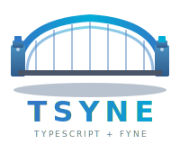

<p align="center">
  
</p>

<p align="center">
  <strong>A TypeScript wrapper for Go's excellent `Fyne` UI toolkit. Terse, elegant, interpreted, pseudo-declarative markup is made possible. Oh, and a Browser</strong>
</p>

<p align="center">
  <em>Logo is Tyne-bridge -ish with Fyne's colors as Tsyne has a 'bridge' to its Go+Fyne underpinnings</em>
</p>

---

Tsyne brings the power of [Fyne](https://fyne.io/), a modern Go UI toolkit, to the TypeScript/Node.js ecosystem with an elegant, pseudo-declarative API that I've been [thinking about for 20+ years](https://paulhammant.com/ui-markup-nirvana/). There's a WYSIWYG designer tool too because I've been [thinking about that for nearly 30 years](https://paulhammant.com/2013/03/28/interface-builders-alternative-lisp-timeline/) with a [Hackernews discussion](https://news.ycombinator.com/item?id=21828622).

## Why Tsyne?

- **Elegant Syntax**: Pseudo-declarative, terse UI markup with closures or blocks depending on your point of view.
- **Cross-Platform**: Build native apps for macOS, Windows, and Linux from a single codebase
- **Type-Safe**: Full TypeScript support with complete type definitions
- **Easy Integration**: Simple npm package that's quick to add to any Node.js project
- **Powerful**: Full access to Fyne's rich widget library and layout system
- **Testable**: Built-in testing framework (TsyneTest) with Playwright-like API for headed/headless testing
- **Single-Script Apps**: Complete desktop apps in one file - no complex project structure needed (like [calculator](examples/calculator.ts), [tic-tac-toe](examples/tictactoe.ts), [stopwatch](examples/17-stopwatch.ts), [dice roller](examples/18-dice-roller.ts))
- **Single-File Distribution**: Embed npm dependency declarations directly in source files (See [INLINE_DEPENDENCY_DECLARATIONS](docs/INLINE_DEPENDENCY_DECLARATIONS.md)) if using `tsyne.exe` in the PATH
- **Browser Mode**: Load TypeScript pages from HTTP servers - enables server-driven desktop UIs where any backend language (Java, Ruby, Python, Go) can serve pages. Big topic, see BROWSER_MODE.md
- **npm Ecosystem**: Use any of npm's 2M+ packages that don't require browser DOM - share validators, API clients, and business logic with your web apps
- **Interpreted + Native**: TypeScript logic is interpreted for rapid iteration; rendering is compiled Go/Fyne for native performance (trade-off: requires Node.js runtime, not single binary distribution)

## When Tsyne Is Not The Right Choice?

Tsyne isn't the right choice for every project. Consider these limitations:

- **No Mobile Support**: Go+Fyne can target iOS and Android directly, but Tsyne requires Node.js runtime which isn't available on mobile platforms. If you need mobile, use Fyne directly in Go.
- **Requires Node.js Runtime**: Pure Go/Fyne apps compile to single standalone binaries. Tsyne apps need Node.js installed, making distribution more complex.
- **IPC Overhead**: The JSON-RPC bridge between TypeScript and Go adds latency compared to native Fyne. For performance-critical UIs with rapid updates, native Fyne may be better.
- **Partial Fyne Coverage**: Tsyne wraps ~50% of Fyne's widget API (see [ROADMAP.md](docs/ROADMAP.md)). Canvas drawing, system tray, and some specialized widgets are not yet available.
- **Fyne's Styling Limitations**: Per-widget color customization is limited by Fyne's architecture. Font styling works well, but colors require custom themes.

**When to use Fyne directly instead:**
- Mobile apps (iOS/Android)
- Single-binary desktop distribution
- Performance-critical real-time UIs
- Full access to Fyne's complete widget library

## FAQ

**Q: How does browser mode differ from regular mode?**

Regular app mode creates standalone desktop applications. Browser mode loads TypeScript pages from HTTP servers dynamically, enabling server-driven UIs where the backend controls the UI (similar to traditional web apps but with native widgets). Pages are the main concept, URLs back/forward buttons exist. See [docs/BROWSER_MODE.md](docs/BROWSER_MODE.md).

**Q: Can Chrome, Firefox and Safari show browser-make pages?**

No, we have our own browser for that and yes we know that's a second-class experience. It could be that someone could make a plugin for Chrome/Edge/Firefox and/or Safari, but it could still be a second-class experience.

**Q: Can I use npm packages in my Tsyne app?**

Yes! Any npm package that doesn't require browser DOM APIs will work. This includes validators, API clients, date libraries, and business logic packages. Share code between your Tsyne desktop app and web frontend. Share code between your Tsyne desktop app and your server-side NodeJS web applications.

**Q: How does testing work?**

Tsyne provides two testing frameworks:
- **TsyneTest** - For testing regular Tsyne apps/components ([docs/TESTING.md](docs/TESTING.md))
- **TsyneBrowserTest** - For testing browser mode pages ([docs/BROWSER_TESTING.md](docs/BROWSER_TESTING.md))

Both support headed and headless modes with aPIR inspired by Selenium/Playwright.

**Q: Can I style widgets with CSS?**

Sort of. Tsyne has a CSS-like styling system for fonts (family, size, style, weight). Per-widget colors are limited by Fyne's architecture - use **themes** for color customization. See the Widget Styling System section below.

**Q: Why TypeScript instead of Go for the UI logic?**

TypeScript provides rapid iteration (no compile step), access to npm's 2M+ packages, and familiar syntax for web developers. The trade-off is requiring Node.js runtime vs single-binary distribution.  For me (Paul) this was always about [pseudo-declarative UI markup languages that could be interpreted](https://paulhammant.com/categories#Pseudo-declarative_UIs) and the browser mode.

**Q: How do I debug my app?**

Use standard Node.js debugging: `node --inspect` or your IDE's debugger. Console.log works normally. For UI issues, enable `TSYNE_HEADED=1` during testing to see the actual UI.

**Q: What percentage of Fyne is wrapped?**

About 50% of widgets and containers. See [docs/ROADMAP.md](docs/ROADMAP.md) for what's remaining. PRs welcome for missing features!

**Q: Can pages in browser mode communicate with the server beyond navigation?**

Pages are TypeScript code with full access to Node.js APIs. Use `fetch()`, `axios`, or any HTTP client to make API calls to your backend while the page is displayed.  They are not runninhg in the DOM (of Chrome, Firefox, Edge Safari, etc) so this isn't a WASM or build-for-DOM use of TS/JS, it is a NodeJs use of TS/JS. As such it's a unsandboxed nightmare so don't put anything live with this tech until that's solved.

**Q: Will Tsyne support the DOM's controls/widgets etc?**

No, this is tied to Fyne. Someone else can do a pure TypeScript pseudo-declarative markup that maybe can run in a regular browser somehow.

## Installation

See **[docs/INSTALLATION.md](docs/INSTALLATION.md)** for complete installation instructions, including:
- Quick start for development
- Standalone installation (recommended for users)
- npm package installation (coming soon)
- Prerequisites and troubleshooting
- Platform support

## Quick Start

### TypeScript

```typescript
import { app } from 'tsyne';

app({ title: "Hello Tsyne" }, (app) => {
  app.window({ title: "Hello Tsyne" }, (win) => {
    win.setContent(() => {
      app.vbox(() => {
        app.label("Welcome to Tsyne!");
        app.button("Click Me", () => {
          console.log("Button clicked!");
        });
      });
    });
    win.show();
  });
});
```

### JavaScript (CommonJS)

```javascript
const { app } = require('tsyne');

app({ title: "Hello Tsyne" }, (app) => {
  app.window({ title: "Hello Tsyne" }, (win) => {
    win.setContent(() => {
      app.vbox(() => {
        app.label("Welcome to Tsyne!");
        app.button("Click Me", () => {
          console.log("Button clicked!");
        });
      });
    });
    win.show();
  });
});
```

### JavaScript (ES Modules)

```javascript
import { app } from 'tsyne';

app({ title: "Hello Tsyne" }, (app) => {
  app.window({ title: "Hello Tsyne" }, (win) => {
    win.setContent(() => {
      app.vbox(() => {
        app.label("Welcome to Tsyne!");
        app.button("Click Me", () => {
          console.log("Button clicked!");
        });
      });
    });
    win.show();
  });
});
```

Tsyne works seamlessly with both TypeScript and JavaScript!

## Single-File Distribution

This builds on single file applications that required Node.js running ts-node. 

Distribute standalone `.ts` apps with npm dependencies declared inline in a similar way as ([Groovy's Grapes](https://docs.groovy-lang.org/latest/html/documentation/grape.html) technology does it.

```typescript
#!/usr/bin/env tsyne

// @Grab('axios@^1.6.0')
// @Grab('date-fns@^3.0.0')

import axios from 'axios';
import { format } from 'date-fns';
import { app } from 'tsyne';

// The rest of your GUI app that neds axios and date-fns` 
```

Dependencies auto-resolve to `~/.tsyne/packages/` at runtime. See [docs/INLINE_DEPENDENCY_DECLARATIONS.md](docs/INLINE_DEPENDENCY_DECLARATIONS.md) for details.

TODO: is this a directed graph or do 100 single-file distributions fight with each other in here?

## Elegant Syntax

Tsyne's API is designed to be elegant and terse, inspired by other pseudo-declarative markups. The syntax feels pseudo-declarative while retaining full imperative power:

**See [HISTORICAL.md](HISTORICAL.md) for the historical context and influences behind Tsyne's design.**

### Calculator Example

Calculator example is important to me because I'm forver comparing to [this one written in Ruby and Shoes UI tech](https://raw.githubusercontent.com/Alexanderlol/GS-Calc/master/calc.rb) by Alexanderlol on GitHub, and [this one for ChrysaLisp](https://github.com/vygr/ChrysaLisp/blob/master/apps/calculator/app.lisp) by Chris Hinsley).

```typescript
// Calculator example demonstrating Tsyne's pseudo-declarative DSL
import { app } from 'tsyne';

let display: any;
let currentValue = "0";
let operator: string | null = null;
let previousValue = "0";

function updateDisplay(value: string) {
  currentValue = value;
  if (display) display.setText(value);
}

function handleNumber(num: string) {
  const newValue = currentValue === "0" ? num : currentValue + num;
  updateDisplay(newValue);
}

function handleOperator(op: string) {
  previousValue = currentValue;
  operator = op;
}

function calculate() {
  if (!operator) return;
  const result = eval(`${parseFloat(previousValue)} ${operator} ${parseFloat(currentValue)}`);
  updateDisplay(isFinite(result) ? result.toString() : "Error");
  operator = null;
}

app({ title: "Calculator" }, (app) => {
  app.window({ title: "Calculator" }, (win) => {
    win.setContent(() => {
      app.vbox(() => {
        display = app.label("0");

        app.grid(4, () => {
          [..."789"].forEach(n => app.button(n, () => handleNumber(n)));
          app.button("÷", () => handleOperator("/"));
          [..."456"].forEach(n => app.button(n, () => handleNumber(n)));
          app.button("×", () => handleOperator("*"));
          [..."123"].forEach(n => app.button(n, () => handleNumber(n)));
          app.button("-", () => handleOperator("-"));
          app.button("0", () => handleNumber("0"));
          app.button("=", () => calculate());
          app.button("+", () => handleOperator("+"));
        });
      });
    });
    win.show();
  });
});
```

See the complete runnable single-script calculator here: [examples/calculator.ts](examples/calculator.ts) - 69 substantive lines, monolithic pattern. See also its [test suite](examples/calculator.test.ts).

See a bigger list of examples with screenshots here: [examples/README.md](examples/README.md)

### Counter Example

```typescript
import { app } from 'tsyne';

let countLabel: any;
let count = 0;

function updateCounter() {
  countLabel.setText(`Count: ${count}`);
}

app({ title: "Counter" }, (app) => {
  app.window({ title: "Counter" }, (win) => {
    win.setContent(() => {
      app.vbox(() => {
        countLabel = app.label("Count: 0");

        app.hbox(() => {
          app.button("-", () => { count--; updateCounter(); });
          app.button("Reset", () => { count = 0; updateCounter(); });
          app.button("+", () => { count++; updateCounter(); });
        });
      });
    });
    win.show();
  });
});
```
See a bigger list of examples with screenshots here: [examples/README.md](examples/README.md)

## Testing with TsyneTest

Tsyne includes **TsyneTest**, a Playwright-like testing framework for testing your UI applications in headed or headless mode.

### Quick Test Example

```typescript
import { TsyneTest } from 'tsyne/test';

async function testCalculator() {
  // Create test instance (headless by default)
  const tsyneTest = new TsyneTest({ headed: false });

  // Build your app
  const testApp = tsyneTest.createApp((app) => {
    // ... build calculator UI ...
  });

  // Get test context
  const ctx = tsyneTest.getContext();
  await testApp.run();

  // Interact with the UI
  await ctx.getByExactText("5").click();
  await ctx.getByExactText("+").click();
  await ctx.getByExactText("3").click();
  await ctx.getByExactText("=").click();

  // Make assertions
  const display = ctx.getByType("label");
  await ctx.expect(display).toHaveText("8");

  // Clean up
  await tsyneTest.cleanup();
}
```

See a bigger list of test examples with screenshots here: [examples/README.md](examples/README.md)

### Test Modes

**Headless (default)** - Fast, no UI, perfect for CI/CD:
```typescript
const tsyneTest = new TsyneTest({ headed: false });
```

**Headed** - Shows UI during testing, great for debugging:
```typescript
const tsyneTest = new TsyneTest({ headed: true });
```

### Locators and Assertions

```typescript
// Find widgets by text
ctx.getByExactText("Submit")
ctx.getByText("Counter:") // partial match
ctx.getByID("widget-id")   // by ID

// Find by type
ctx.getByType("button")
ctx.getByType("label")
ctx.getByType("entry")

// Actions
await locator.click()
await locator.type("text")
await locator.getText()

// Fluent-Selenium Style API - Text Assertions
await ctx.getByText("Submit").within(5000).click()  // Retry for 5 seconds
await ctx.getByText("Loading...").without(3000)     // Wait for disappearance
await ctx.getByID("status").shouldBe("Success")     // Fluent assertion
await ctx.getByID("message").shouldContain("error") // Partial match
await ctx.getByID("email").shouldMatch(/^.+@.+$/)   // Regex match

// Fluent-Selenium Style API - Property Assertions
await ctx.getByID("agree").shouldBeChecked()        // Checkbox state
await ctx.getByID("volume").shouldHaveValue(75)     // Slider/entry value
await ctx.getByID("submit").shouldBeEnabled()       // Enabled state
await ctx.getByID("myWidget").shouldHaveType("button") // Widget type
await ctx.getByID("modal").shouldBeVisible()        // Visibility

// Assertions (Traditional style)
await ctx.expect(locator).toHaveText("exact text")
await ctx.expect(locator).toContainText("partial")
await ctx.expect(locator).toBeVisible()
await ctx.expect(locator).toExist()
await ctx.expect(locator).toMatchText(/pattern/)

// Negative assertions
await ctx.expect(locator).toNotHaveText("wrong")
await ctx.expect(locator).toNotBeVisible()
await ctx.expect(locator).toNotExist()
```

### Running Tests

```bash
# Run tests in headless mode
npm test

# Run with visible UI
npm run test:calculator:headed
```

**See [docs/TESTING.md](docs/TESTING.md) for complete documentation and the [calculator test app](test-apps/calculator/) for a comprehensive example.**

**Testing examples:**
- **[examples/calculator.test.ts](examples/calculator.test.ts)** - Simple calculator tests (integration tests using TsyneTest)
- **[examples/locators.test.ts](examples/locators.test.ts)** - Comprehensive locator and assertion examples
- **[test-apps/calculator-advanced/calculator.test.ts](test-apps/calculator-advanced/calculator.test.ts)** - Advanced calculator integration tests
- **[test-apps/calculator-advanced/calculator-logic.test.ts](test-apps/calculator-advanced/calculator-logic.test.ts)** - Fast Jest unit tests for business logic

## Browser Testing with TsyneBrowserTest

Tsyne includes **TsyneBrowserTest**, a Playwright-inspired testing framework for testing Tsyne Browser pages. It automatically starts a test HTTP server and provides navigation helpers.

```typescript
import { browserTest } from 'tsyne';

browserTest(
  'Test /home',
  [
    { path: '/', code: `const { vbox, label } = tsyne; vbox(() => { label('Home'); });` },
    { path: '/about', code: `const { vbox, label } = tsyne; vbox(() => { label('About'); });` }
  ],
  async (bt) => {
    await bt.createBrowser('/');
    bt.assertUrl('/');
    await bt.navigate('/about');
    bt.assertUrl('/about');
  }
);
```

**See [docs/BROWSER_TESTING.md](docs/BROWSER_TESTING.md)** for complete documentation including:
- Playwright-inspired locators, actions, and expectations
- Fluent-selenium style API (within, without, shouldBe, shouldContain)
- Integration with Jest, Mocha, Vitest
- Complete API reference and examples

## API Reference

For the complete API reference, see **[docs/API_REFERENCE.md](docs/API_REFERENCE.md)**.

** A Quick Reference, though**

**Layouts:** `vbox`, `hbox`, `grid`, `scroll`, `hsplit`, `vsplit`, `tabs`, `center`, `border`, `gridwrap`

**Container Widgets:** `card`, `accordion`, `form`

**Basic Widgets:** `button`, `label`, `entry`, `multilineentry`, `passwordentry`

**Input Widgets:** `checkbox`, `select`, `slider`, `radiogroup`

**Display Widgets:** `progressbar`, `separator`, `hyperlink`

**Data Widgets:** `table`, `list`, `tree`, `richtext`, `image`, `toolbar`

**Dialogs:** `showInfo`, `showError`, `showConfirm`, `showFileOpen`, `showFileSave`

**Window Methods:** `resize`, `centerOnScreen`, `setFullScreen`, `setMainMenu`

**Widget Methods:** `setText`, `getText`, `hide`, `show`, `when`, `refresh`

## Theme Support

Tsyne supports light and dark themes that automatically apply to all widgets in your application.

### Setting the Theme

```typescript
import { app, setTheme } from 'tsyne';

app({ title: 'My App' }, () => {
  // Switch to dark theme
  await setTheme('dark');

  // Switch to light theme
  await setTheme('light');

  // Get current theme
  const currentTheme = await getTheme(); // Returns 'dark' or 'light'
});
```

### Using Theme with App Instance

```typescript
const myApp = app({ title: 'My App' }, () => {
  // ... build your UI
});

// Set theme on app instance
await myApp.setTheme('dark');

// Get current theme
const theme = await myApp.getTheme();
```

### Theme Features

- **Automatic widget styling**: All widgets automatically adapt to the selected theme
- **Light theme**: Bright background with dark text, suitable for well-lit environments
- **Dark theme**: Dark background with light text, suitable for low-light environments
- **Runtime switching**: Change themes dynamically without restarting the application
- **Persistent across windows**: Theme applies to all windows in the application

### Example: Theme Switcher

```typescript
import { app } from 'tsyne';

let themeLabel: any;

app({ title: 'Theme Demo' }, (app) => {
  app.window({ title: 'Theme Demo' }, (win) => {
    win.setContent(() => {
      app.vbox(() => {
        themeLabel = app.label('Current Theme: Light');

        app.button('Dark Theme', async () => {
          const myApp = (win as any).ctx.bridge;
          await myApp.send('setTheme', { theme: 'dark' });
          themeLabel.setText('Current Theme: Dark');
        });

        app.button('Light Theme', async () => {
          const myApp = (win as any).ctx.bridge;
          await myApp.send('setTheme', { theme: 'light' });
          themeLabel.setText('Current Theme: Light');
        });
      });
    });

    win.show();
  });
});
```

See `examples/theme.ts` for a complete theme demonstration with various widgets.

## Widget Styling System

Tsyne includes a CSS-like styling system, allowing you to separate presentation from structure. Define styles once in a stylesheet module, and they automatically apply to widgets based on their type.

### Quick Start with Styling

The styling system works similarly to CSS - define styles for widget types, and they're automatically applied when widgets are created.

**Without styles** (`examples/form-unstyled.ts`):
```typescript
import { app } from 'tsyne';

app({ title: 'Form Demo' }, (app) => {
  app.window({ title: 'Form Demo' }, (win) => {
    win.setContent(() => {
      app.vbox(() => {
        app.label('Registration Form');
        app.button('Submit', () => {});
      });
    });
    win.show();
  });
});
```

**With styles** (`examples/form-styled.ts`):
```typescript
import { app } from 'tsyne';
import './form-styles';  // ← Only difference: import stylesheet!

app({ title: 'Form Demo' }, (app) => {
  app.window({ title: 'Form Demo' }, (win) => {
    win.setContent(() => {
      app.vbox(() => {
        app.label('Registration Form');  // Automatically styled!
        app.button('Submit', () => {});  // Automatically styled!
      });
    });
    win.show();
  });
});
```

**Stylesheet** (`examples/form-styles.ts`):
```typescript
import { styles, FontFamily, FontStyle } from 'tsyne';

styles({
  root: {
    font_family: FontFamily.SANS_SERIF,
    font_size: 10
  },
  label: {
    font_style: FontStyle.ITALIC,
    font_size: 12
  },
  button: {
    font_weight: 'bold'
  },
  entry: {
    font_family: FontFamily.MONOSPACE
  }
});
```

### Style Properties

The styling system supports the following properties:

#### Font Properties
- **`font_family`**: Font family - `FontFamily.SANS_SERIF`, `FontFamily.SERIF`, or `FontFamily.MONOSPACE`
- **`font_style`**: Font style - `FontStyle.NORMAL`, `FontStyle.ITALIC`, `FontStyle.BOLD`, or `FontStyle.BOLD_ITALIC`
- **`font_weight`**: Font weight - `'normal'` or `'bold'`
- **`font_size`**: Font size in points (number)

#### Color Properties (limited support)
- **`color`**: Text color - hex number (`0xRRGGBB`) or CSS color string
- **`background_color`**: Background color - hex number or CSS color string

**Note**: Fyne has limitations on per-widget color customization. Font styling works reliably across widgets, but colors require custom themes or custom widget renderers. The styling system accepts color properties for future compatibility.

### Widget Selectors

Styles can be defined for these widget types:

- **`root`**: Base styles applied to all widgets (unless overridden)
- **`button`**: Button widgets
- **`label`**: Label widgets
- **`entry`**: Single-line text input widgets
- **`multilineentry`**: Multi-line text area widgets
- **`passwordentry`**: Password input widgets
- **`checkbox`**: Checkbox widgets
- **`select`**: Dropdown select widgets
- **`slider`**: Slider widgets
- **`radiogroup`**: Radio button groups
- **`progressbar`**: Progress bar widgets
- **`hyperlink`**: Hyperlink widgets
- **`table`**: Table widgets
- **`list`**: List widgets

### Complete Styling Example

Swiby-style approach with separate stylesheet:

**styles.ts** (stylesheet module):
```typescript
import { styles, FontFamily, FontStyle } from 'tsyne';

styles({
  root: {
    font_family: FontFamily.SANS_SERIF,
    font_style: FontStyle.NORMAL,
    font_size: 10
  },
  label: {
    font_style: FontStyle.ITALIC,
    font_size: 12,
    color: 0xAA0000  // Red text
  },
  entry: {
    font_family: FontFamily.MONOSPACE,
    font_size: 12,
    background_color: 0xFFFFC6  // Light yellow background
  },
  button: {
    font_weight: 'bold'
  }
});
```

**main.ts** (application):
```typescript
import { app } from 'tsyne';
import './styles';  // Import stylesheet - styles auto-apply!

app({ title: 'Styled App' }, (app) => {
  app.window({ title: 'Styled App' }, (win) => {
    win.setContent(() => {
      app.vbox(() => {
        app.label('Enter your details:');
        app.entry('Name');
        app.entry('Email');
        app.button('Submit', () => {});
      });
    });
    win.show();
  });
});
```

### Style Inheritance

Styles follow a cascading pattern:
1. **Root styles** apply to all widgets
2. **Widget-specific styles** override root styles
3. Later style definitions override earlier ones

```typescript
styles({
  root: {
    font_size: 10,        // All widgets: 10pt
    font_style: FontStyle.NORMAL
  },
  label: {
    font_size: 12,        // Labels: 12pt (overrides root)
    font_style: FontStyle.ITALIC  // Labels: italic (overrides root)
  }
});
```

### API Reference

**`styles(definitions)`**
Define styles for widget types.

```typescript
import { styles, FontStyle } from 'tsyne';

styles({
  label: { font_style: FontStyle.BOLD },
  button: { font_weight: 'bold' }
});
```

**`clearStyles()`**
Clear all defined styles.

```typescript
import { clearStyles } from 'tsyne';

clearStyles();
```

**`getStyleSheet()`**
Get the global stylesheet instance.

```typescript
import { getStyleSheet } from 'tsyne';

const sheet = getStyleSheet();
const labelStyle = sheet?.getComputedStyle('label');
```

**See [HISTORICAL.md](HISTORICAL.md) for a discussion**

### Limitations

Due to Fyne's architecture:
- **Color customization** is limited for standard widgets (requires custom themes or renderers)
- **Font styles** (bold, italic, monospace) work well across widgets
- **Font families** are limited to sans-serif, serif, and monospace
- **Widget-specific styling** may have platform-specific variations

For advanced color customization, consider using Fyne's theme system (see Theme Support section above).

### Examples

See these examples demonstrating the styling system:
- **`examples/form-unstyled.ts`** - Form without any styling
- **`examples/form-styled.ts`** - Same form with stylesheet applied
- **`examples/form-styles.ts`** - Stylesheet module defining visual styles

Run the examples to see the difference:
```bash
npm run build
node examples/form-unstyled.js   # Without styles
node examples/form-styled.js     # With styles
```

## Context Menus

All Tsyne widgets support right-click context menus, enabling contextual actions based on what the user clicks.

### Usage

Use `widget.setContextMenu()` to add a context menu to any widget:

```typescript
const todoLabel = label('Buy potatoes');

todoLabel.setContextMenu([
  {
    label: 'Mark Complete',
    onSelected: () => {
      console.log('Marked complete!');
    }
  },
  {
    label: 'Edit',
    onSelected: () => {
      console.log('Edit item');
    }
  },
  { isSeparator: true },
  {
    label: 'Delete',
    onSelected: () => {
      console.log('Delete item');
    }
  }
]);
```

### Menu Item Options

```typescript
interface ContextMenuItem {
  label: string;           // Menu item text
  onSelected: () => void;  // Callback when selected
  disabled?: boolean;      // Gray out and disable item
  checked?: boolean;       // Show checkmark
  isSeparator?: boolean;   // Render as separator line
}
```

### Examples

**Todo List with Context Menus:**
```typescript
const items = ['Buy milk', 'Buy potatoes', 'Call dentist'];

items.forEach(item => {
  const itemLabel = label(`☐ ${item}`);

  itemLabel.setContextMenu([
    {
      label: 'Mark Complete',
      onSelected: () => markComplete(item)
    },
    {
      label: 'Edit',
      onSelected: () => editItem(item)
    },
    { isSeparator: true },
    {
      label: 'Delete',
      onSelected: () => deleteItem(item)
    }
  ]);
});
```

**Document Editor with Context Menu:**
```typescript
const textEntry = entry('Document text...');

textEntry.setContextMenu([
  {
    label: 'Cut',
    onSelected: () => clipboard.cut()
  },
  {
    label: 'Copy',
    onSelected: () => clipboard.copy()
  },
  {
    label: 'Paste',
    onSelected: () => clipboard.paste()
  },
  { isSeparator: true },
  {
    label: 'Select All',
    onSelected: () => selectAll()
  }
]);
```

**Dynamic Menu Items:**
```typescript
const label = label('Status: Active');

label.setContextMenu([
  {
    label: 'Enable Feature',
    checked: featureEnabled,
    onSelected: () => toggleFeature()
  },
  {
    label: 'Admin Only',
    disabled: !isAdmin,
    onSelected: () => adminAction()
  }
]);
```

### Demo

See **`examples/pages/context-menu-demo.ts`** for a complete todo list example with context menus.

```bash
npm run build
node examples/server.js
npx tsyne-browser http://localhost:3000/
# Navigate to Context Menu Demo page and right-click on todo items
```

## Browser Mode

Tsyne includes a Swiby-inspired browser system that loads **Tsyne TypeScript pages** from web servers dynamically, similar to how web browsers load HTML pages. This enables server-side page generation from any language (Spring, Sinatra, Flask, Express, etc.).

```bash
# Run the browser with a URL
npx tsyne-browser http://localhost:3000/
```

```typescript
// Example page (pages/index.ts)
const { vbox, label, button } = tsyne;

vbox(() => {
  label('Welcome to Tsyne Browser!');
  button('Go to About', () => {
    browserContext.changePage('/about');
  });
});
```

**See [docs/BROWSER_MODE.md](docs/BROWSER_MODE.md)** for complete documentation including:
- Browser API and BrowserContext
- Server implementations (Node.js, Python, Ruby, Java)
- Page format and navigation flow
- Examples and use cases

## State Management and Architectural Patterns

Tsyne provides powerful state management utilities and supports multiple architectural patterns (MVC, MVVM, MVP) for building scalable applications.

### State Passing and Two-Way Communication

Tsyne supports:
- **Passing state into components**: Initialize widgets with data from your application
- **Retrieving state back**: Get data from dialogs and forms (dialog pattern)
- **Two-way data binding**: Keep state synchronized with UI automatically
- **Observable state**: React to state changes automatically

### Quick State Management Examples

#### Observable State

```typescript
import { app, ObservableState } from 'tsyne';

const count = new ObservableState(0);
let countLabel: any;

// Subscribe to state changes
count.subscribe((newValue) => {
  countLabel?.setText(`Count: ${newValue}`);
});

app({ title: "State Demo" }, (app) => {
  app.window({ title: "State Demo" }, (win) => {
    win.setContent(() => {
      app.vbox(() => {
        countLabel = app.label("Count: 0");
        app.button("Increment", () => count.set(count.get() + 1));
      });
    });
    win.show();
  });
});
```

#### State Store (Centralized State)

```typescript
import { StateStore } from 'tsyne';

interface AppState {
  user: string;
  count: number;
}

const store = new StateStore<AppState>({
  user: 'Guest',
  count: 0
});

// Subscribe to all state changes
store.subscribe(state => {
  console.log('State changed:', state);
  updateUI(state);
});

// Update state
store.set('user', 'John');
store.update(s => ({ ...s, count: s.count + 1 }));
```

#### Dialog State Passing

```typescript
// Pass state into a dialog and get results back
const dialog = new ProfileDialog(currentProfile);
const result = await dialog.show();

if (result.confirmed) {
  store.update(state => ({
    ...state,
    profile: result.data
  }));
}
```

### Architectural Patterns

Tsyne supports standard UI architectural patterns:

| Pattern | Best For | Example |
|---------|----------|---------|
| **MVC** | Traditional desktop apps, Swing-like architecture | [mvc-counter.ts](examples/mvc-counter.ts) |
| **MVVM** | Data-heavy apps with automatic UI sync | [mvvm-todo.ts](examples/mvvm-todo.ts) |
| **MVP** | Maximum testability, swappable views | [mvp-login.ts](examples/mvp-login.ts) |
| **Data Binding** | Form inputs, real-time sync | [data-binding.ts](examples/data-binding.ts) |

#### MVC Example

```typescript
// Model - Business logic
class CounterModel extends Model {
  private count = 0;
  increment() { this.count++; this.notifyChanged(); }
  getCount() { return this.count; }
}

// View - UI presentation
class CounterView {
  createUI(onIncrement: () => void) {
    vbox(() => {
      this.label = label('Count: 0');
      button('Increment', onIncrement);
    });
  }
}

// Controller - Connects Model and View
class CounterController {
  constructor(private model: CounterModel, private view: CounterView) {
    this.model.subscribe(() => this.updateView());
  }
  handleIncrement() { this.model.increment(); }
}
```

#### MVVM Example

```typescript
// ViewModel with observable properties
class TodoViewModel extends ViewModel {
  todos = new ObservableState<TodoItem[]>([]);
  newTodoText = new ObservableState('');

  addTodo() {
    this.model.addTodo(this.newTodoText.get());
    this.newTodoText.set('');
    this.updateFromModel();
  }
}

// View binds to ViewModel
class TodoView {
  constructor(private viewModel: TodoViewModel) {
    // Automatic UI updates when state changes
    this.viewModel.todos.subscribe(() => this.updateUI());
  }
}
```

**See [docs/PATTERNS.md](docs/PATTERNS.md) for complete documentation on all architectural patterns, data binding, and state management.**

### State Management Examples

Check out these comprehensive examples:

- **[data-binding.ts](examples/data-binding.ts)** - Two-way data binding with observable state
- **[mvc-counter.ts](examples/mvc-counter.ts)** - Classic MVC pattern (like Swing)
- **[mvvm-todo.ts](examples/mvvm-todo.ts)** - MVVM pattern with data binding
- **[mvp-login.ts](examples/mvp-login.ts)** - MVP pattern with passive views
- **[dialog-state.ts](examples/dialog-state.ts)** - Dialog state passing pattern

Run the examples:

```bash
npm run build
node examples/data-binding.js
node examples/mvc-counter.js
node examples/mvvm-todo.js
```

## Architecture

Tsyne uses a unique architecture to bridge TypeScript and Go:

```
┌─────────────────────┐
│   Your TypeScript   │
│   Application       │
└──────────┬──────────┘
           │
           ▼
┌─────────────────────┐
│   Tsyne Client       │
│   (TypeScript)      │
└──────────┬──────────┘
           │ JSON-RPC via stdio
           ▼
┌─────────────────────┐
│   Tsyne Bridge       │
│   (Go + Fyne)       │
└──────────┬──────────┘
           │
           ▼
┌─────────────────────┐
│   Native UI         │
│   (macOS/Win/Linux) │
└─────────────────────┘
```

1. **Tsyne Client** (TypeScript): Provides the pseudo-declarative API and spawns the bridge process
2. **Tsyne Bridge** (Go): Manages Fyne widgets and communicates via JSON messages over stdio
3. **Message Protocol**: Bidirectional JSON-RPC for commands and events

## Examples

> **100+ Examples Available!** See **[examples/README.md](examples/README.md)** for a comprehensive catalog of all examples organized by category, with direct links to source files and screenshots. Whether you're learning Tsyne basics or building complex applications, there's an example for you.

### Basic Examples

Check out the `examples/` directory:

**Getting Started:**
- `hello.ts` - Simple Hello World
- `counter.ts` - Counter with increment/decrement
- `calculator.ts` - Calculator with number pad
- `form.ts` - Form with text inputs

**Widget Examples:**
- `input-widgets.ts` - MultiLineEntry, PasswordEntry, Separator, and Hyperlink widgets
- `advanced-widgets.ts` - Card, Accordion, Form, and Center layout
- `specialized-widgets.ts` - Tree, RichText, Image, Border, and GridWrap
- `checkbox.ts` - Checkbox with state tracking and callbacks
- `select.ts` - Dropdown select with multiple options
- `slider.ts` - Slider controls for volume, brightness, etc.
- `radiogroup.ts` - Radio button groups for mutually exclusive choices
- `progressbar.ts` - Progress indicators for downloads and loading
- `scroll.ts` - Scrollable container for long content
- `grid.ts` - Grid layout calculator example
- `split.ts` - Resizable horizontal and vertical split containers
- `tabs.ts` - Tabbed interface for organizing content
- `table.ts` - Data tables with headers and sortable rows
- `list.ts` - Scrollable lists with selection callbacks

**Dialog Examples:**
- `dialogs-info.ts` - Information and error dialogs
- `dialogs-confirm.ts` - Confirmation dialogs for critical actions
- `dialogs-file.ts` - File open and save dialogs

**Advanced UI Examples:**
- `window-sizing.ts` - Window sizing, positioning, and fullscreen
- `menu-bar.ts` - Application menu bars with File/Edit/Help menus
- `toolbar.ts` - Toolbars with actions, separators, and spacers
- `theme.ts` - Light and dark theme switching with widget showcase

**Pattern Examples:**
- `data-binding.ts` - Two-way data binding with observable state
- `mvc-counter.ts` - Classic MVC pattern (like Swing)
- `mvvm-todo.ts` - MVVM pattern with data binding
- `mvp-login.ts` - MVP pattern with passive views
- `dialog-state.ts` - Dialog state passing pattern

**Styling Examples:**
- `form-unstyled.ts` - Registration form without custom styling
- `form-styled.ts` - Same form with Swiby-like stylesheet applied
- `form-styles.ts` - Stylesheet module defining visual styles

**Browser Examples:**
- `run-browser.ts` - Example of creating a browser programmatically
- `server.js` - Sample Node.js HTTP server serving multiple Tsyne TypeScript pages
- `web-features.test.js` - Comprehensive browser testing examples
- `widget-interactions.test.js` - Widget interaction testing examples

Run an example:

```bash
npm run build
node examples/calculator.js
node examples/input-widgets.js
node examples/advanced-widgets.js
node examples/specialized-widgets.js
node examples/checkbox.js
node examples/select.js
node examples/slider.js
node examples/radiogroup.js
node examples/progressbar.js
node examples/scroll.js
node examples/grid.js
node examples/split.js
node examples/tabs.js
node examples/dialogs-info.js
node examples/dialogs-confirm.js
node examples/dialogs-file.js
node examples/window-sizing.js
node examples/menu-bar.js
node examples/toolbar.js
node examples/theme.js
node examples/table.js
node examples/list.js
node examples/form-unstyled.js
node examples/form-styled.js
```

### Test Applications - Two Architectural Patterns

We provide **two calculator implementations** demonstrating different approaches:

#### 1. Simple Calculator - Monolithic Pattern

**Best for:** Learning, prototypes, demos < 200 lines

```
test-apps/calculator-simple/
├── calculator.ts (150 lines - all in one file)
├── calculator.test.ts (TsyneTest only)
└── README.md
```

**Features:**
- All code in one place
- Simple and straightforward
- Quick to prototype
- TsyneTest integration tests only

**Trade-offs:**
- Cannot unit test logic separately
- Slower test feedback (~3s)
- Hard to maintain at scale

```bash
npm run run:calculator-simple
npm run test:calculator-simple
```

#### 2. Advanced Calculator - Decomposed Pattern

**Best for:** Production apps, teams, complex logic, TDD

```
test-apps/calculator-advanced/
├── calculator-logic.ts (Pure business logic)
├── calculator-logic.test.ts (34 Jest unit tests)
├── calculator-ui.ts (UI presentation)
├── calculator.test.ts (11 TsyneTest integration tests)
└── README.md + TESTING-STRATEGY.md
```

**Features:**
- Separated business logic and UI
- Fast Jest unit tests (~100ms for 34 tests)
- TDD-friendly development
- Reusable logic (CLI, web, API)
- Comprehensive test coverage (45 tests total)

**Trade-offs:**
- More files and boilerplate
- Higher learning curve

```bash
npm run run:calculator          # Run the app
npm run test:calculator         # Integration tests
npm run test:calculator:logic   # Unit tests (fast!)
npm test                        # All tests
```

**See [test-apps/README.md](test-apps/README.md) for detailed comparison and decision guide.**

## Architecture Patterns

### Monolithic (Simple) vs Decomposed (Advanced)

Tsyne supports two architectural patterns for building applications:

| Pattern | When to Use | Testing Approach |
|---------|-------------|------------------|
| **Monolithic** | Demos, prototypes, < 200 lines | TsyneTest integration tests only |
| **Decomposed** | Production, teams, complex logic | Jest unit tests + TsyneTest integration |

**Monolithic Example:**
```typescript
// All in one file
let count = 0;
let display: any;

function increment() {
  count++;
  display.setText(`Count: ${count}`);  // UI coupled with logic
}

app(() => {
  display = label("Count: 0");
  button("+", increment);
});
```

**Decomposed Example:**
```typescript
// calculator-logic.ts (testable with Jest!)
export class CalculatorLogic {
  private count = 0;

  increment(): number {
    return ++this.count;
  }

  getDisplay(): string {
    return `Count: ${this.count}`;
  }
}

// calculator-ui.ts
import { CalculatorLogic } from './calculator-logic';

export class CalculatorUI {
  private logic = new CalculatorLogic();
  private display: any;

  build() {
    this.display = label(this.logic.getDisplay());
    button("+", () => {
      this.logic.increment();
      this.display.setText(this.logic.getDisplay());
    });
  }
}

// calculator-logic.test.ts (Jest - fast!)
test('increment', () => {
  const calc = new CalculatorLogic();
  expect(calc.increment()).toBe(1);
  expect(calc.getDisplay()).toBe("Count: 1");
});
```

**Benefits of Decomposed Pattern:**
- ✅ Fast unit tests (100ms vs 3s)
- ✅ TDD-friendly
- ✅ Reusable logic
- ✅ Easy to maintain

**See [test-apps/README.md](test-apps/README.md) for complete comparison and migration guide.**

## Design Philosophy

Tsyne follows these design principles:

1. **Pseudo-declarative where possible**: UI structure is defined using nested function calls
2. **Imperative when needed**: Full JavaScript for event handlers and state management
3. **Terse and elegant**: Minimal boilerplate, maximum expressiveness
4. **Type-safe**: Complete TypeScript definitions for IDE support
5. **Easy to use**: Simple npm install, straightforward API

**See [HISTORICAL.md](HISTORICAL.md) for the frameworks and patterns that inspired Tsyne's design.**

## Building from Source

```bash
# Install dependencies
npm install

# Build the Go bridge
npm run build:bridge

# Build the TypeScript library
npm run build

# Run an example
node examples/hello.js
```

## Requirements

- **Node.js**: 16.0.0 or higher
- **Go**: 1.21 or higher (for building the bridge)
- **Platform-specific dependencies**:
  - macOS: Xcode command line tools
  - Linux: X11 development libraries
  - Windows: MinGW-w64 (for CGO)

## Contributing

Contributions are welcome! Please feel free to submit issues and pull requests.

## License

MIT License - see [LICENSE](LICENSE) file for details

## Credits and Acknowledgments

### Core Technology

- **[Fyne](https://fyne.io/)** - The fantastic Go UI toolkit that powers Tsyne's native rendering
  - Created by Andrew Williams and the Fyne.io team
  - Provides cross-platform native widgets, Material Design theming, and excellent performance

### Example Applications

Several example applications in this repository are ports or adaptations from other projects:

- **Chess** (`examples/chess/`) - Ported from [andydotxyz/chess](https://github.com/andydotxyz/chess)
  - Original author: Andy Williams (andydotxyz)
  - Adapted to Tsyne's TypeScript API with chess.js game engine

- **Solitaire** (`examples/solitaire/`) - Ported from [fyne-io/solitaire](https://github.com/fyne-io/solitaire)
  - Original authors: Fyne.io contributors
  - Adapted to Tsyne with simplified drag-and-drop interactions

- **Game of Life** (`examples/game-of-life/`) - Ported from [fyne-io/life](https://github.com/fyne-io/life)
  - Original authors: Fyne.io contributors
  - Conway's cellular automaton adapted to Tsyne's declarative API

- **TodoMVC** (`examples/todomvc.ts`) - Inspired by [TodoMVC](https://todomvc.com/)
  - Standard todo application specification
  - Demonstrates state management and persistence patterns

All ported applications maintain attribution to their original authors and licenses. See individual example directories for detailed attribution and licensing information.

### Inspirations and Design Influences

Tsyne's design draws from several influential frameworks and patterns:

- The Interface Builder before the current Interface Builder, written in Lisp.
- Ruby Shoes - Created by _why_the_lucky_stiff - Pioneering elegant DSL design for desktop GUIs
- Swiby - Ruby/Swing integration by jeanlazarou - CSS-like styling separate from UI structure
- QML - Qt's declarative UI language - Seamless declarative/imperative integration

**See [HISTORICAL.md](HISTORICAL.md) for detailed discussion of these influences and how they shaped Tsyne's design.**

Special thanks to: Andrew Williams, colleagues and contributors - For Fyne UI toolkit and example applications

## Documentation

### Getting Started
- **[docs/QUICKSTART.md](docs/QUICKSTART.md)** - Get started in 5 minutes
- **[README.md](README.md)** - You are here! Main documentation
- **[docs/API_REFERENCE.md](docs/API_REFERENCE.md)** - Complete API reference for widgets, layouts, and dialogs
- **[docs/PROS_AND_CONS.md](docs/PROS_AND_CONS.md)** - Tsyne vs Electron/Tauri comparison and decision guide
- **[docs/LLM.md](docs/LLM.md)** - Quick reference guide for LLMs if you're assigning work to 'em'

### State Management, Patterns and pattern-centric examples

- **[docs/PATTERNS.md](docs/PATTERNS.md)** - Complete guide to architectural patterns (MVC, MVVM, MVP), state management, and data binding
- **[examples/data-binding.ts](examples/data-binding.ts)** - Observable state and computed state examples
- **[examples/mvc-counter.ts](examples/mvc-counter.ts)** - MVC pattern implementation
- **[examples/mvvm-todo.ts](examples/mvvm-todo.ts)** - MVVM pattern with ViewModels
- **[examples/mvp-login.ts](examples/mvp-login.ts)** - MVP pattern with passive views
- **[examples/dialog-state.ts](examples/dialog-state.ts)** - Dialog state passing pattern

### Browser Mode

A major piece of this is the ability to server up "Tsyne Pages" and navigate them. An experience that you should be familiar with from Chrome, Safari, or Firefox. This isn't using those though there's a dedicated browser.  Pages would be served from regular choices of HTTP server and many of the existing server-side frameworks that go with them.

- **[docs/BROWSER_MODE.md](docs/BROWSER_MODE.md)** - Complete guide to browser mode 
- **[docs/BROWSER_TESTING.md](docs/BROWSER_TESTING.md)** - Testing framework for browser pages

### Testing

- **[docs/TESTING.md](docs/TESTING.md)** - Complete guide to TsyneTest testing framework (for apps/components)
- **[docs/BROWSER_TESTING.md](docs/BROWSER_TESTING.md)** - Complete guide to TsyneBrowserTest (for browser pages)
- **[docs/TESTING_CHECKLIST.md](docs/TESTING_CHECKLIST.md)** - Comprehensive testing checklist for browser features
- **[test-apps/README.md](test-apps/README.md)** - Two architectural patterns comparison
- **[test-apps/calculator-simple/README.md](test-apps/calculator-simple/README.md)** - Monolithic pattern
- **[test-apps/calculator-advanced/README.md](test-apps/calculator-advanced/README.md)** - Decomposed pattern
- **[test-apps/calculator-advanced/TESTING-STRATEGY.md](test-apps/calculator-advanced/TESTING-STRATEGY.md)** - Two-tier testing

### Development

- **[docs/ARCHITECTURE.md](docs/ARCHITECTURE.md)** - Internal design and architecture
- **[CONTRIBUTING.md](CONTRIBUTING.md)** - Guide for contributors
- **[docs/PUBLISHING.md](docs/PUBLISHING.md)** - Publishing to npm with bundled binaries
- **[docs/ROADMAP.md](docs/ROADMAP.md)** - Feature roadmap and TODO list
- **[HISTORICAL.md](HISTORICAL.md)** - Historical context, influences, and acknowledgments
