# Tsyne Examples

A comprehensive collection of showcase applications demonstrating Tsyne's capabilities, ranging from simple "Hello World" to complex multi-feature applications.

  

## Overview

These examples are designed to:
- Help developers learn Tsyne's API and patterns
- Demonstrate best practices for building desktop GUIs
- Showcase the framework's widget library
- Provide test coverage examples
- Serve as starting points for new applications

## 📸 Generating Screenshots

All 11 showcase examples support automated screenshot capture via the `TAKE_SCREENSHOTS=1` environment variable:

```bash
# Capture screenshot for a single example
TSYNE_HEADED=1 TAKE_SCREENSHOTS=1 npm test examples/01-hello-world.test.ts
# Screenshot saved to examples/screenshots/01-hello-world.png

# Capture all screenshots (run each test individually)
for test in examples/{01..13}-*.test.ts; do
  TSYNE_HEADED=1 TAKE_SCREENSHOTS=1 npm test "$test"
done
```

**How it works:**
- Each test file includes screenshot capture logic at the most representative visual state
- Screenshots are captured after the UI is rendered and verified visible
- A 500ms wait ensures proper rendering before capture
- Screenshots are saved to `examples/screenshots/` with matching filenames

**Requirements:**
- A display (X11 on Linux, native on Mac/Windows)
- Both `TSYNE_HEADED=1` (show GUI) and `TAKE_SCREENSHOTS=1` (capture) must be set
- Screenshots directory will be created automatically if it doesn't exist

## Running Examples

```bash
# Run an example directly
npm run build
node examples/01-hello-world.js

# Run with TypeScript (requires ts-node)
npx ts-node examples/01-hello-world.ts

# Run tests for an example
npm test examples/01-hello-world.test.ts

# Run tests in headed mode (see the GUI)
TSYNE_HEADED=1 npm test examples/01-hello-world.test.ts
```

## Examples by Complexity

### 🟢 Beginner (Basic Concepts)

#### **01-hello-world.ts**

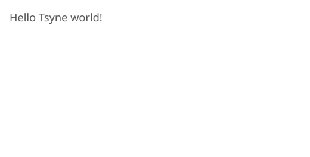

- **What it demonstrates:** Minimal Tsyne application structure
- **Widgets used:** Label, VBox
- **Concepts:** Basic app setup, window creation
- **Attribution:** Portions copyright Ryelang developers (Apache 2.0)
- **Test:** `npm test examples/01-hello-world.test.ts`

```typescript
// Simple hello world - just 15 lines!
app({ title: 'Hello' }, (a) => {
  a.window({ title: 'Hello', width: 400, height: 200 }, (win) => {
    win.setContent(() => {
      a.vbox(() => {
        a.label('Hello Tsyne world!');
      });
    });
    win.show();
  });
});
```

#### **02-counter.ts**

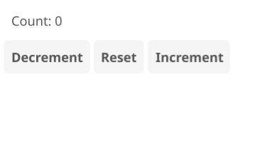

- **What it demonstrates:** State management, event handling
- **Widgets used:** Label, Button, HBox, VBox
- **Concepts:** Closures for state, async updates, multiple buttons
- **Test:** `npm test examples/02-counter.test.ts`

#### **03-button-spacer.ts**

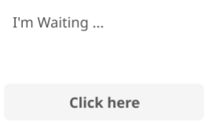

- **What it demonstrates:** Button interaction, label updates, layout spacing
- **Widgets used:** Label, Button, VBox
- **Concepts:** Click handlers, setText(), layout spacers
- **Attribution:** Portions copyright Ryelang developers (Apache 2.0)
- **Test:** `npm test examples/03-button-spacer.test.ts`

### 🟡 Intermediate (Multi-Widget Apps)

#### **04-feedback-form.ts**

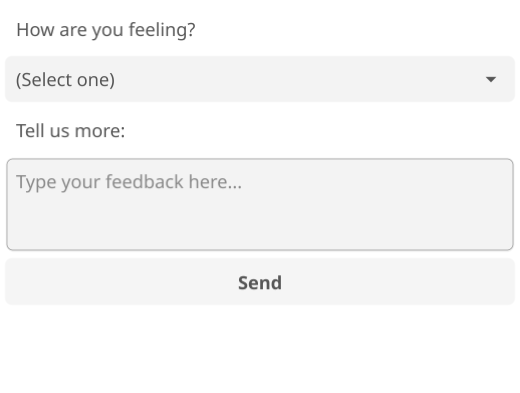

- **What it demonstrates:** Multi-input forms, dropdowns, dialogs
- **Widgets used:** Label, Select, MultilineEntry, Button, Dialog
- **Concepts:** Multiple input types, form submission, dialogs
- **Attribution:** Portions copyright Ryelang developers (Apache 2.0)
- **Test:** `npm test examples/04-feedback-form.test.ts`

#### **05-live-clock.ts**

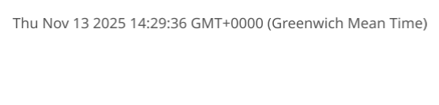

- **What it demonstrates:** Real-time updates with intervals
- **Widgets used:** Label, VBox
- **Concepts:** setInterval, time formatting, async updates
- **Attribution:** Portions copyright Ryelang developers (Apache 2.0)
- **Test:** `npm test examples/05-live-clock.test.ts`

#### **07-signup-form.ts**

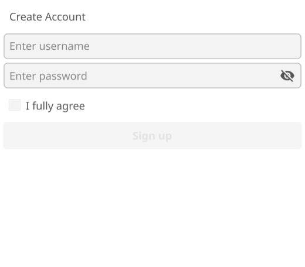

- **What it demonstrates:** Form validation, conditional UI
- **Widgets used:** Entry, PasswordEntry, Checkbox, Button, Form, Dialog
- **Concepts:** Button enable/disable, form validation, password fields
- **Attribution:** Portions copyright Ryelang developers (Apache 2.0)
- **Test:** `npm test examples/07-signup-form.test.ts`

#### **09-players-list.ts**

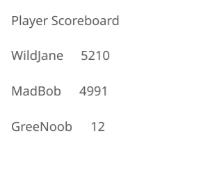

- **What it demonstrates:** Data display, list rendering
- **Widgets used:** Label, List, HBox, VBox
- **Concepts:** Structured data, list widget, row templates
- **Attribution:** Portions copyright Ryelang developers (Apache 2.0)
- **Test:** `npm test examples/09-players-list.test.ts`

### 🔴 Advanced (Complex Features)

#### **10-multiplication-table.ts**

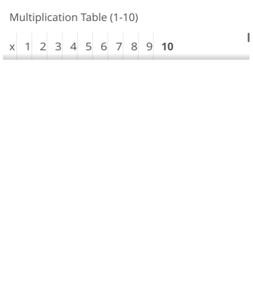

- **What it demonstrates:** Table widget, dynamic cell population
- **Widgets used:** Table, Label
- **Concepts:** createCell/updateCell pattern, mathematical calculations
- **Attribution:** Portions copyright Ryelang developers (Apache 2.0)
- **Test:** `npm test examples/10-multiplication-table.test.ts`

#### **11-percentage-clock.ts**

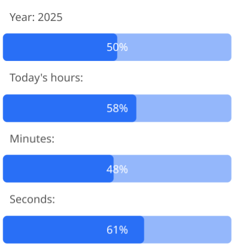

- **What it demonstrates:** Progress bars, time calculations
- **Widgets used:** Label, ProgressBar, VBox
- **Concepts:** Progress indication, leap year calculation, percentage math
- **Attribution:** Portions copyright Ryelang developers (Apache 2.0)
- **Test:** `npm test examples/11-percentage-clock.test.ts`

#### **12-shopping-list.ts**

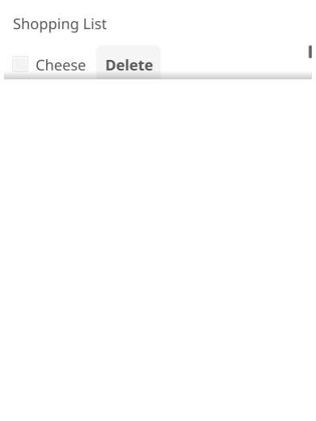

- **What it demonstrates:** Dynamic list management, CRUD operations
- **Widgets used:** Entry, Checkbox, Button, Scroll, VBox, HBox
- **Concepts:** Add/delete items, checkbox state, scroll containers
- **Attribution:** Portions copyright Ryelang developers (Apache 2.0)
- **Test:** `npm test examples/12-shopping-list.test.ts`

#### **13-tabbed-settings.ts**

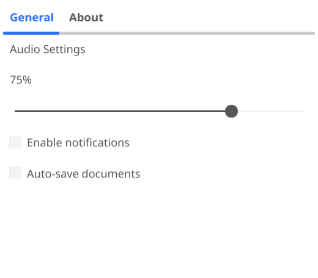

- **What it demonstrates:** Tabbed interface, settings panel
- **Widgets used:** Tabs, Slider, Checkbox, Label, VBox
- **Concepts:** Multi-tab UI, slider with label updates, preferences
- **Attribution:** Portions copyright Ryelang developers (Apache 2.0)
- **Test:** `npm test examples/13-tabbed-settings.test.ts`

## Comprehensive Examples

### **calculator.ts**

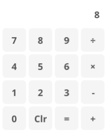

A complete calculator application demonstrating:
- **Complex state management** - Full calculator logic with operations
- **Event-driven architecture** - Button clicks update display
- **Grid layout** - 4x4 button grid with operators
- **Real-time display** - Shows current input and results
- **Test suite** - 5 comprehensive tests covering all operations
- **Test:** `npm test examples/calculator.test.ts`

### **todomvc.ts** & **todomvc-ngshow.ts**

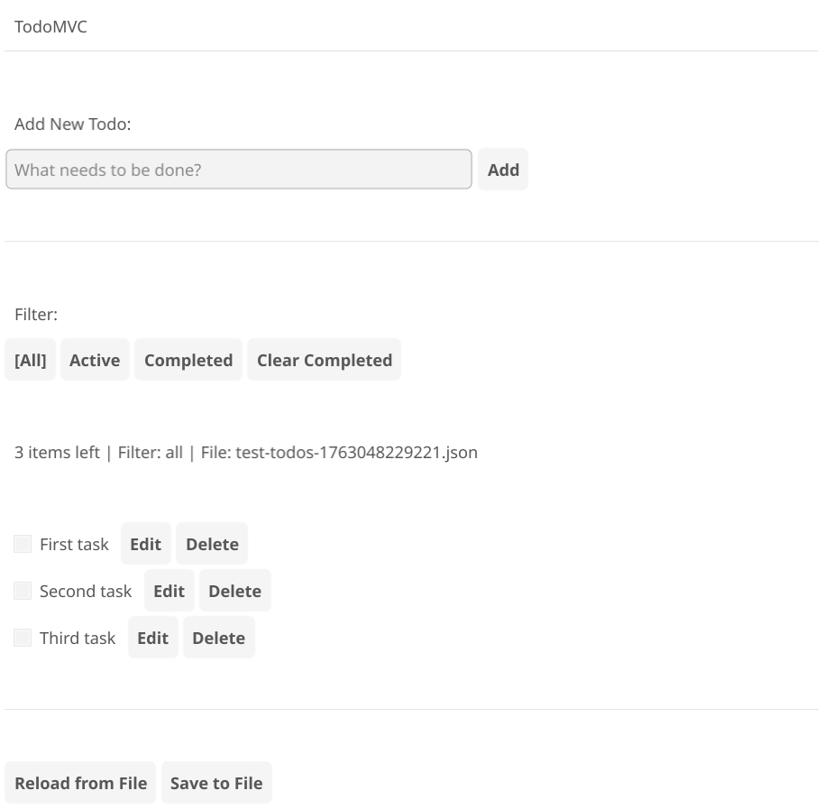 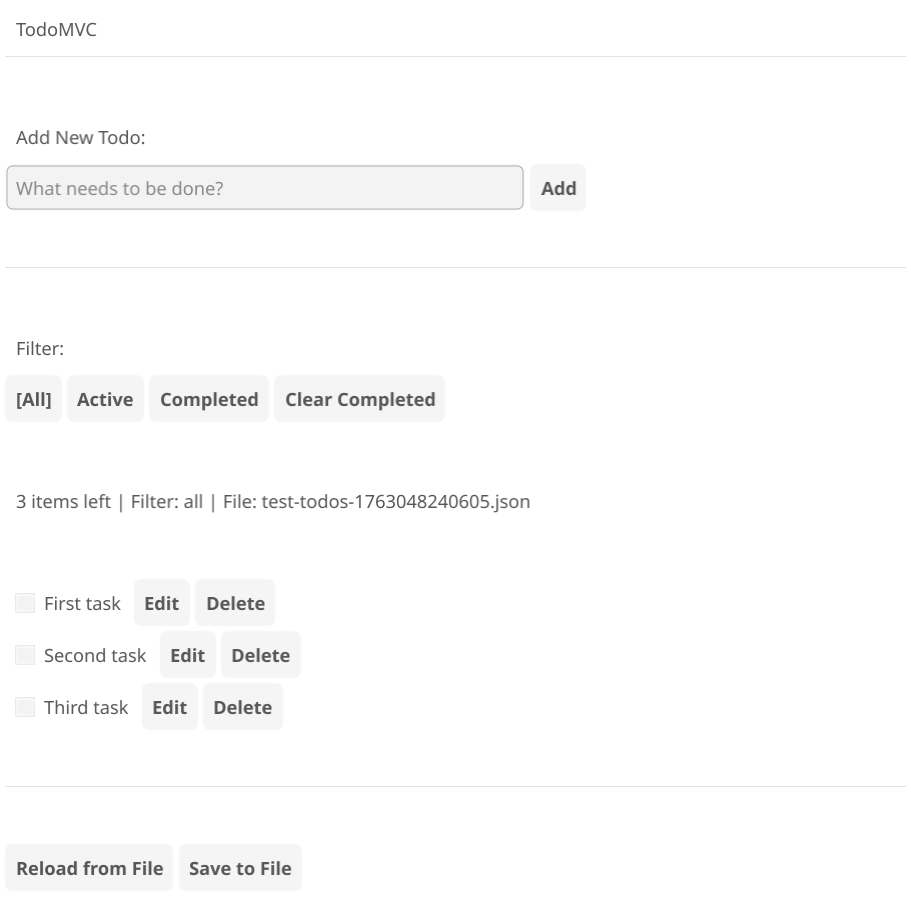

The TodoMVC applications are the most complete examples, demonstrating:
- **Full MVC architecture** - Observable store with change listeners
- **File persistence** - Save/load to JSON
- **Multiple filters** - All/Active/Completed with smart visibility
- **ngShow directive** - Declarative visibility control (ngShow variant)
- **Edit mode** - Inline editing with save/cancel
- **CRUD operations** - Add, update, delete, toggle todos
- **Comprehensive test suite** - 16 tests per variant
- **Test:** `npm test examples/todomvc.test.ts` or `npm test examples/todomvc-ngshow.test.ts`

See [todomvc.ts](./todomvc.ts) and [todomvc-ngshow.ts](./todomvc-ngshow.ts) for details.

## Widget Coverage

These examples collectively demonstrate:

**Basic Widgets:**
- Label (text display)
- Button (click actions)
- Entry (text input)
- Checkbox (boolean input)

**Advanced Inputs:**
- MultilineEntry (text area)
- PasswordEntry (masked input)
- Select (dropdown)
- Slider (numeric range)

**Containers:**
- VBox (vertical layout)
- HBox (horizontal layout)
- Scroll (scrollable area)
- Form (form layout)
- Tabs (tabbed interface)

**Display:**
- ProgressBar (progress indication)
- Table (tabular data)
- List (dynamic lists)
- Separator (visual divider)

**Interactions:**
- Dialog (modal popups)
- Window (app windows)

## Testing Patterns

All examples include comprehensive test suites demonstrating:
- Test setup with TsyneTest
- Widget interaction testing
- State verification
- Async operation handling
- Cleanup and teardown

Example test structure:
```typescript
describe('Example Tests', () => {
  let tsyneTest: TsyneTest;
  let ctx: TestContext;

  beforeEach(async () => {
    tsyneTest = new TsyneTest({ headed: false });
  });

  afterEach(async () => {
    await tsyneTest.cleanup();
  });

  test('should demonstrate feature', async () => {
    const testApp = await tsyneTest.createApp((app) => {
      // Create app
    });
    ctx = tsyneTest.getContext();
    await testApp.run();

    // Test assertions
    await ctx.expect(ctx.getByExactText('Expected Text')).toBeVisible();
  });
});
```

## Attribution

Examples 01, 03, 04, 05, 07, 09, 10, 11, 12, and 13 are inspired by and ported from the [Rye-Fyne project](https://github.com/refaktor/rye-fyne) licensed under Apache 2.0. Each file includes proper attribution in single-line comments at the top.

Example 02 (counter) is an original Tsyne example.

## Contributing

When adding new examples:
1. Include comprehensive tests
2. Add proper attribution if ported from another project
3. Document what the example demonstrates
4. Update this README with the new example
5. Keep examples simple and focused on specific concepts

## Learn More

- [Tsyne Documentation](../README.md)
- [MVC Pattern Guide](../more_mvc_like_for_todomvc_app.md)
- [Testing Guide](../TESTING.md)
- [Widget Reference](../src/widgets.ts)

## Example Statistics

- **Total Examples:** 11 + 2 (TodoMVC variants)
- **Total Test Files:** 13
- **Widget Types Demonstrated:** 20+
- **Lines of Code:** ~1,500 (examples + tests)
- **Test Coverage:** 100% (all examples tested)
