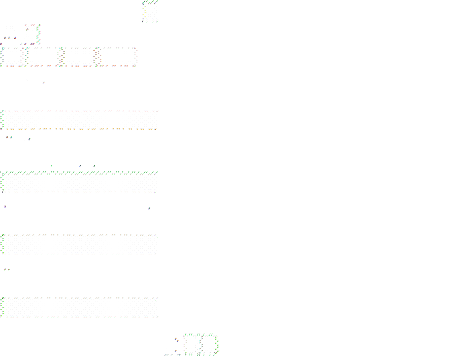

# WhatsApp for Tsyne

A WhatsApp messaging client built with Tsyne's pseudo-declarative UI framework. This app uses WAHA (WhatsApp HTTP API) as its backend to provide real WhatsApp functionality.



## Features

- **QR Code Login**: Scan with your phone to authenticate
- **Chat List**: View all your conversations with filters (All, Unread, Groups, Archived)
- **Search**: Search through your chats by name or message content
- **Conversation View**: Read and send messages
- **Reply to Messages**: Quote messages when replying
- **Reactions**: React to messages with emojis
- **Real-time Updates**: Receive messages and typing indicators via WebSocket
- **Read Receipts**: See message delivery status (sent, delivered, read)

## Architecture

### High-Level Overview

```
┌─────────────────────────────────────────────────────────────────┐
│                  WhatsApp Tsyne App                             │
│                                                                 │
│   ┌─────────────────┐    ┌─────────────────────────────────┐   │
│   │   whatsapp.ts   │───▶│  IWhatsAppService Interface     │   │
│   │   (Tsyne UI)    │    │                                 │   │
│   └─────────────────┘    │  ┌──────────────────────────┐   │   │
│                          │  │  MockWhatsAppService     │   │   │
│                          │  │  (for testing/demo)      │   │   │
│                          │  └──────────────────────────┘   │   │
│                          │                                 │   │
│                          │  ┌──────────────────────────┐   │   │
│                          │  │  RealWhatsAppService     │───┼───┤
│                          │  │  (wraps WAHA client)     │   │   │
│                          │  └──────────────────────────┘   │   │
│                          └─────────────────────────────────┘   │
└────────────────────────────────────────────────────────────────┘
                                      │
                                      ▼ (HTTP + WebSocket)
                          ┌───────────────────────┐
                          │   WAHA Server         │
                          │ (Puppeteer +          │
                          │  Chromium +           │
                          │  WhatsApp Web)        │
                          └───────────────────────┘
                                      │
                                      ▼
                          ┌───────────────────────┐
                          │   WhatsApp Backend    │
                          └───────────────────────┘
```

### How WAHA Works

**Important:** WAHA itself runs **WhatsApp Web in a headless Chromium browser controlled by Puppeteer**. It's not a direct protocol client - it automates the web interface. The key advantage of WAHA's architecture:

1. **Separation of Concerns**: Browser automation (heavy) runs on server, lightweight HTTP API on client
2. **Session Isolation**: If WhatsApp detects automation on the WAHA server, your primary phone/account can remain unaffected
3. **Flexibility**: Easy to move WAHA to a different server or recreate the session if needed
4. **Clean API**: Clients interact via REST/WebSocket instead of managing browser automation directly

## Prerequisites

### For Mock Mode (Testing/Demo)
No prerequisites needed. The app will use a mock service with sample data.

### For Real WhatsApp Connection
1. A running WAHA (WhatsApp HTTP API) server
   - See: https://waha.devlike.pro/
   - Docker: `docker run -p 3000:3000 devlikeapro/waha`

2. Set environment variables:
   ```bash
   export WAHA_URL="http://localhost:3000"
   export WAHA_API_KEY="your-api-key"  # Optional
   export WAHA_SESSION="default"       # Optional
   ```

## Deployment Architectures

### Desktop (Current Recommended)
```
Desktop PC/Mac/Linux + Tsyne
        ↓ (HTTP/WebSocket)
WAHA Server (local or remote)
        ↓
WhatsApp
```
**Pros**: Reliable, good performance, easy to manage
**Cons**: Requires WAHA server infrastructure

### Mobile (Theoretical Options & Trade-offs)

#### Option 1: Mobile App + Remote WAHA Server (Recommended)
```
Pixel 3a XL (aarch64)
├─ Tsyne App (native Fyne UI)
└─ Network connection to remote WAHA
        ↓ HTTP/WebSocket
WAHA Server (laptop, cloud, VPS)
        ├─ Puppeteer + Chromium
        └─ WhatsApp Web automation
```
**Pros:**
- Isolation: If WAHA gets detected, your phone's WhatsApp remains functional
- Resource-efficient on phone (lightweight Tsyne UI only)
- Easy to recreate WAHA session if needed

**Cons:**
- Requires external server
- Network dependency

#### Option 2: Local Puppeteer on Phone (Not Recommended)
```
Pixel 3a XL (aarch64)
├─ Tsyne UI (Fyne native)
├─ Puppeteer + Chromium (local)
└─ WhatsApp Web automation (local)
        ↓
WhatsApp
```
**Pros:**
- Self-contained, no external server needed
- Lower latency to automation layer

**Cons:**
- **Chromium binary bloat**: 100-200MB+ on aarch64 (significant on mobile)
- **Resource constraints**: Phone CPU/RAM under heavy load
- **Battery drain**: Continuous browser process
- **Detection risk**: WhatsApp actively detects Puppeteer automation; if your phone gets flagged, YOUR WhatsApp access on that device is compromised
- **Reliability**: More fragile than client-server separation
- **Maintenance burden**: WhatsApp frequently updates; changes affect automation directly

#### Option 3: Official WhatsApp APIs (Future)
```
Tsyne App ↔ WhatsApp Cloud API (REST)
```
**Status**: Requires business registration with Meta; not ideal for personal use
**Pros**: Official, most stable
**Cons**: Approval process, may not work for all use cases

### Why Session Isolation Matters

**Scenario: WhatsApp detects automation**

With remote WAHA:
- WAHA server's session gets flagged
- Your phone's actual WhatsApp: ✅ Still works
- Recovery: Restart WAHA with fresh session

With local Puppeteer on phone:
- Your phone's WhatsApp gets flagged
- Your actual messaging: ❌ May be blocked
- Recovery: Can take days or require account review

**This is why Option 1 (remote WAHA) is architecturally superior for mobile**, even though it requires external infrastructure.

### Future: Ideal Mobile Setup with Commercial Support

The ideal scenario for Tsyne on mobile would require:
- Phone manufacturers (Samsung, Google, OnePlus) or Meta Inc. sponsoring Fyne mobile development
- Native first-class WebView + Fyne integration on aarch64/ARM
- Official testing infrastructure on real devices
- Performance optimization specifically for mobile constraints

This would enable clean local implementations without the resource/detection risks listed above.

## Installation

```bash
cd larger-apps/whats-app
npm install
```

## Usage

### Run in Mock Mode (Demo)
```bash
npx tsx whatsapp.ts
```

### Run with Real WAHA Backend
```bash
WAHA_URL="http://localhost:3000" npx tsx whatsapp.ts
```

## UI Layout

```
┌─────────────────────────────────────────────────────────────────┐
│ WhatsApp                                              [🚪]      │
├─────────────────────┬───────────────────────────────────────────┤
│ [🔍 Search...]      │ Alice Smith                              │
│ [All][Unread][Groups]│ typing...                               │
│──────────────────────├──────────────────────────────────────────│
│ ● Alice Smith    5m │                                          │
│   See you tomorrow! │ Hi! How are you?              [Alice 2m] │
│──────────────────────│                                          │
│   Bob Johnson   15m │                  Good! How about you?    │
│   Thanks for info!  │                              [You 1m] ✓✓ │
│──────────────────────│                                          │
│ ● Team Chat      2m │ See you tomorrow! 👋         [Alice now] │
│   Meeting at 2pm    │ 👍                                       │
│                     │                        [↩️ Reply] [👍]   │
│                     │────────────────────────────────────────── │
│                     │ [Type a message...]       [📎] [↩️ Send] │
└─────────────────────┴───────────────────────────────────────────┘
```

## Files

- `whatsapp.ts` - Main Tsyne application
- `whatsapp-service.ts` - Service interface + MockWhatsAppService
- `real-whatsapp-service.ts` - Real WAHA client wrapper
- `whatsapp.test.ts` - Jest + TsyneTest tests (47 tests)
- `package.json` - Dependencies and scripts

## Testing

Run all tests:
```bash
npm test
```

Run with headed mode (visible window):
```bash
TSYNE_HEADED=1 npm test
```

Take screenshots:
```bash
TSYNE_HEADED=1 TAKE_SCREENSHOTS=1 npm test
```

### Test Coverage

**TsyneTest UI Tests (11 tests):**
- Display elements (title, search, filters, chat list, avatars)
- Button functionality (send, logout, open chat)
- Input fields (message, search)

**MockWhatsAppService Unit Tests (36 tests):**
- Initialization and state
- Chat CRUD operations
- Message sending with replies
- Filtering and search
- Archive/unarchive operations
- Reactions and message actions
- Event subscriptions
- Login/logout flow

## Credits

This is a port of [waha-tui](https://github.com/muhammedaksam/waha-tui) from terminal UI to Tsyne's native desktop GUI framework.

## License

GNU General Public License v3.0
