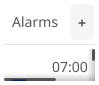

# Alarms

Alarm manager app for setting, toggling, and deleting alarms.

## Features

- Create new alarms with time picker
- Toggle alarms on/off
- Delete individual alarms
- List view of all alarms
- Notification when alarm fires

## Controls

| Action | Description |
|--------|-------------|
| Add Alarm | Create a new alarm at specified time |
| Toggle | Enable/disable an alarm without deleting |
| Delete | Remove an alarm permanently |

## Alarm Properties

Each alarm has:
- **Time**: Hour and minute
- **Enabled**: Whether the alarm is active
- **Label**: Optional description

## Services

The alarms app uses dependency injection for testability:

- `IClockService` - Provides current time for alarm checking
- `INotificationService` - Sends notification when alarm fires
- `IAppLifecycle` - Manages app close behavior
