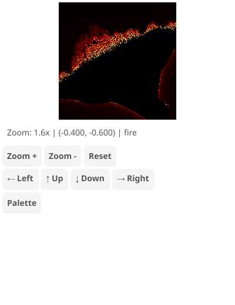

# Burning Ship Fractal Explorer

The dramatic Burning Ship fractal with its distinctive ship-like shape.

## Features

- Multiple color palettes (classic, fire, ice, rainbow, ocean, psychedelic, grayscale, copper)
- Click/tap to zoom and recenter
- Scroll wheel zoom centered on cursor
- Keyboard controls for navigation

## Controls

- **Click/Tap**: Zoom in at clicked point
- **Scroll**: Zoom in/out centered on cursor
- **+/-**: Zoom in/out
- **Arrow keys**: Pan
- **P/Space**: Cycle palette
- **R**: Reset view

## Algorithm

The Burning Ship uses `z = (|Re(z)| + i|Im(z)|)² + c`, where the absolute values of the real and imaginary parts create the distinctive "burning ship" appearance with its hull and masts.
