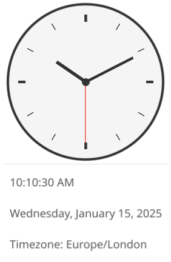

# Clock

Analog and digital clock app displaying current time and date.

## Features

- Analog clock face with hour, minute, and second hands
- Digital time display
- Date display with day of week
- Timezone indicator
- Real-time updates every second

## Controls

The clock runs automatically with no user interaction required.

## Architecture

The clock uses a declarative hand binding system where each clock hand's position is computed from a rotation function:

- **Hour hand**: Rotates based on hours + minutes/60
- **Minute hand**: Rotates based on minutes + seconds/60
- **Second hand**: Rotates based on seconds

This allows the hands to smoothly track the current time without manual position calculations.

## Services

The clock app uses dependency injection for testability:

- `IClockService` - Provides current time (can be mocked for testing)
- `INotificationService` - For future alarm/notification features
- `IAppLifecycle` - Manages app close behavior
