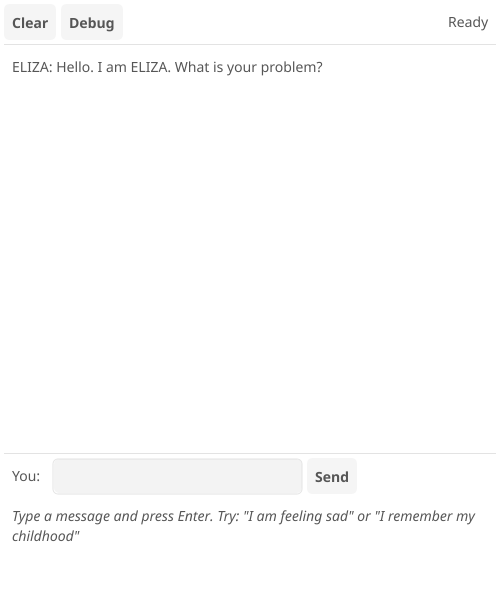

# ELIZA - Classic Pattern Matching Chatbot

A Tsyne implementation of Joseph Weizenbaum's 1966 ELIZA chatbot, demonstrating pattern matching and symbolic processing.



## About ELIZA

ELIZA was created at MIT in 1966 and simulates a Rogerian psychotherapist using pattern matching and transformation rules. It's one of the earliest examples of natural language processing and demonstrates how simple pattern matching can create the illusion of understanding.

## Features

- Over 20 keyword patterns with multiple response templates
- Pronoun reflection system (I -> you, my -> your, etc.)
- Wildcard pattern matching with captures
- Debug mode showing pattern matching details
- Clear conversation option
- Works on both mobile and desktop

## Controls

- **Clear**: Reset the conversation
- **Debug**: Toggle debug mode to see pattern matching details
- **Send**: Send your message (or press Enter)

## Classic Inputs to Try

- "I am feeling sad"
- "I remember my childhood"
- "I have a dream"
- "My mother doesn't understand me"
- "I can't do anything right"
- "You don't like me"
- "Are you a computer?"

## How It Works

### Pattern Matching

ELIZA uses a keyword-based system with wildcards:

```
Pattern: "* i am * sad *"
Input:   "well i am feeling sad today"
Matches: ["well", "feeling", "today"]
```

### Reflection

Pronouns are transformed for natural responses:

- "I" -> "you"
- "my" -> "your"
- "am" -> "are"
- "me" -> "you"

### Example

```
User: I am feeling sad
Pattern: "* i am * sad *" (rank 1)
Captures: ["", "feeling", ""]
Reflection: "feeling" -> "feeling"
Response: "I'm sure it's not pleasant to be feeling."
```

## Debug Mode

Enable debug mode to see:
- The pattern that matched your input
- The rank/priority of that pattern
- The wildcard captures from your message

## Historical Significance

ELIZA was groundbreaking in demonstrating:

1. Simple rules can create an illusion of intelligence
2. Pattern matching for language processing
3. Human tendency to anthropomorphize computers
4. Power of reflection and open-ended questions

Many users became emotionally attached to ELIZA, revealing insights about human-computer interaction that remain relevant today.

## References

- Weizenbaum, Joseph (1966). "ELIZA—A Computer Program For the Study of Natural Language Communication Between Man And Machine". *Communications of the ACM*. 9 (1): 36–45.
