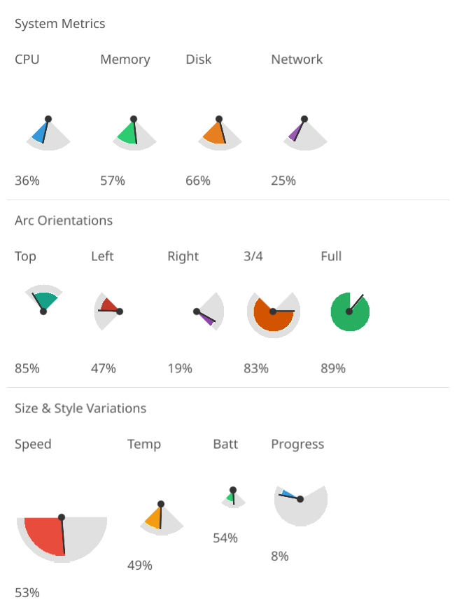

# Gauge Dashboard

Cosyne declarative canvas demo showcasing the gauge primitive with various configurations.



## Features

- **System Metrics**: CPU, Memory, Disk, Network gauges with standard bottom-facing arcs
- **Arc Orientations**: Top, Left, Right, 3/4 Circle, and Full Circle configurations
- **Size & Style Variations**: Different radii (20-50px) and arc sweeps (90-240°)

## Run

```bash
./scripts/tsyne phone-apps/gauge-dashboard/gauge-cosyne.ts
```
