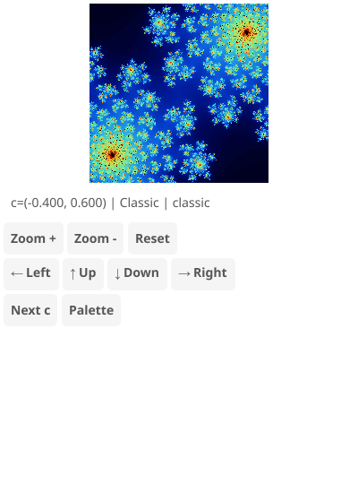

# Julia Set Explorer

Interactive Julia fractal viewer with adjustable c parameter and multiple presets.

## Features

- 6 famous Julia set presets (Classic, Dendrite, Spiral, Rabbit, Dragon, Siegel)
- Multiple color palettes (classic, fire, ice, rainbow, ocean, psychedelic, grayscale, copper)
- Click/tap to zoom and recenter
- Scroll wheel zoom centered on cursor
- Keyboard controls for navigation

## Controls

- **Click/Tap**: Zoom in at clicked point
- **Scroll**: Zoom in/out centered on cursor
- **+/-**: Zoom in/out
- **Arrow keys**: Pan
- **P/Space**: Cycle palette
- **N**: Next preset
- **R**: Reset view

## Algorithm

The Julia set uses the iteration `z = z² + c` where c is a fixed complex constant. Points that remain bounded after many iterations are in the set.
