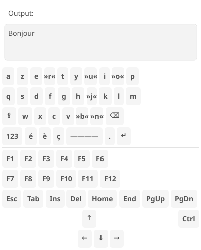
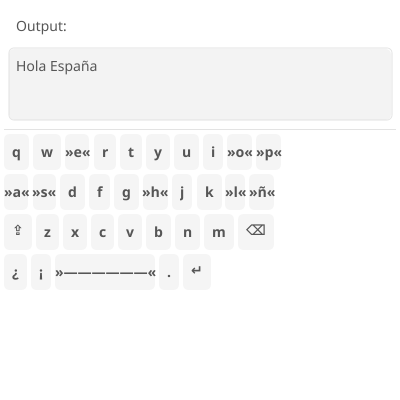

# Virtual Keyboard

A mobile phone virtual keyboard for Tsyne, ported from [QtFreeVirtualKeyboard](https://github.com/githubuser0xFFFF/QtFreeVirtualKeyboard).

## Screenshots

### English US - "Hello World."


### French AZERTY - "Bonjour"


### Spanish - "Hola España"


## Features

- **Multi-locale support**: Pure TypeScript layout definitions (no JSON/YAML)
- **Visual key feedback**: Keys flash `»key«` when pressed
- **Wide spacebar**: Proportionally sized for mobile UX
- **Shift toggle**: Auto-disables after typing one letter
- **Symbol mode**: Numbers and punctuation on `123` toggle
- **Test harness**: Text area receives keyboard input for testing

## Supported Locales

| Locale | Layout | Special Characters |
|--------|--------|-------------------|
| `en-US` | QWERTY | `@#$%^&*` |
| `en-GB` | QWERTY | `£` (instead of `#`) |
| `fr-FR` | AZERTY | `éèêëàâùûôîç€` |
| `it-IT` | QWERTY | `àèéìíòóùú€` |
| `es-ES` | QWERTY | `ñáéíóúü¿¡` |

## Usage

```typescript
import { createKeyboardApp, createKeyboardTestHarness } from './keyboard';
import { EnUS } from './locales/en-us';
import { FrFR } from './locales/fr-fr';

// Standalone app with default (US) layout
createKeyboardApp(app);

// With specific locale
createKeyboardApp(app, FrFR);

// Test harness with text area
const harness = createKeyboardTestHarness(app, EnUS);
// harness.textArea receives keyboard input
```

## Adding New Locales

Create a new file in `locales/` with the layout definition:

```typescript
// locales/de-de.ts
import type { KeyboardLayout } from '../keyboard';

export const DeDE: KeyboardLayout = {
  name: 'Deutsch',
  locale: 'de-DE',

  letters: [
    ['q', 'w', 'e', 'r', 't', 'z', 'u', 'i', 'o', 'p'],
    ['a', 's', 'd', 'f', 'g', 'h', 'j', 'k', 'l', 'ö'],
    ['y', 'x', 'c', 'v', 'b', 'n', 'm'],
  ],

  symbols: [
    ['1', '2', '3', '4', '5', '6', '7', '8', '9', '0'],
    ['ä', 'ü', 'ß', '€', '@', '#', '&', '*', '!'],
    ['?', '-', '+', '=', '(', ')', '/'],
  ],
};
```

## Tests

19 TsyneTest tests covering:
- Basic input and typing
- Shift functionality
- Symbol mode switching
- Backspace handling
- Locale-specific characters (£, é, ñ, etc.)

```bash
npm test -- phone-apps/keyboard/keyboard.test.ts
```

## License

MIT License - see [LICENSE](LICENSE)

- Portions Copyright (c) 2015 Uwe Kindler
- Portions Copyright (c) 2013 Tomasz Olszak
- Portions Copyright (c) 2024 Paul Hammant
