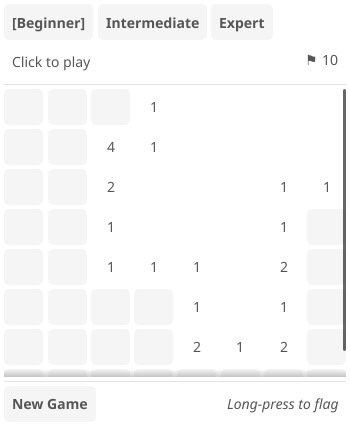

# Minefield (Minesweeper)

Classic Minesweeper game with adaptive sizing for phone, tablet, and desktop.



## About

Minefield is a Tsyne port of the classic puzzle game. Clear the minefield by revealing all safe cells without hitting a mine.

## Implementation Comparison

This port preserves the elegant declarative style of the original ChrysaLisp while adapting it to TypeScript's idioms.

### ChrysaLisp (Lisp)

The original uses S-expression nesting for layout:

```lisp
(ui-window *window* ()
  (ui-flow window_flow (:flow_flags +flow_down_fill)
    (ui-title-bar *window_title* "Minefield" ...)
    (ui-flow view (:flow_flags +flow_flag_align_hcenter)
      ...)))
```

Grid cells created imperatively with lambda iteration:

```lisp
(each (lambda (_)
  (. (defq mc (Button)) :connect (+ +event_click _))
  (def mc :text "" :border 1 :min_width 32 :min_height 32)
  (. game_grid :add_child mc)) (range 0 gwh))
```

### Tsyne (TypeScript)

The Tsyne version uses nested callbacks for the same declarative feel:

```typescript
this.a.vbox(() => {
  this.a.hbox(() => {
    this.a.button('[Beginner]').onClick(() => this.selectDifficulty('beginner'));
    this.a.button('Intermediate').onClick(() => this.selectDifficulty('intermediate'));
  });
  this.a.scroll(() => {
    this.a.grid(width, () => {
      for (let i = 0; i < totalCells; i++) {
        this.renderCell(i);
      }
    });
  });
});
```

Cell rendering uses a pseudo-declarative binding pattern:

```typescript
private renderCell(index: number): void {
  const config: CellConfig = {
    index,
    state: this.game.getCellState(index),
    value: this.game.getCellValue(index),
    size: this.game.getCellSize(),
  };

  if (config.state === 'hidden') {
    this.a.button('').onClick(() => this.handleCellClick(index, false));
  } else if (config.state === 'revealed') {
    this.a.label(getCellText(config), undefined, 'center');
  }
}
```

### Key Similarities

| Aspect | ChrysaLisp | Tsyne |
|--------|------------|-------|
| Layout | `ui-flow` nesting | `vbox`/`hbox` callbacks |
| Grid | `each` + `add_child` | `grid()` + loop |
| Events | `:connect +event_click` | `.onClick(() => ...)` |
| State | `game_map` ('b'/'f'/'r') | `CellState` enum |
| Board | `game_board` (0-9) | `board[]` with `MINE=9` |

Both achieve declarative UI composition - Lisp through S-expressions, TypeScript through fluent callbacks.

## License

Portions copyright ChrysaLisp contributors.
Portions copyright Paul Hammant 2025.

Ported from [ChrysaLisp Minefield](https://github.com/vygr/ChrysaLisp/blob/master/apps/minefield/app.lisp).

This code is licensed under the GNU General Public License v2.0 (GPL-2.0).
See the original repository for full license terms.

## Features

- Three difficulty levels with adaptive cell sizing
- First click is always safe (mines placed after first click)
- Flood fill reveal for empty areas
- Flag suspicious cells to mark potential mines
- Mine counter shows remaining unflagged mines
- Works on phone, tablet, and desktop

## Difficulty Levels

| Level | Grid Size | Mines | Cell Size |
|-------|-----------|-------|-----------|
| Beginner | 8x8 | 10 | 36px |
| Intermediate | 16x16 | 40 | 28px |
| Expert | 24x16 | 80 | 24px |

## How to Play

1. **Click any cell** to start - the first click is always safe
2. **Numbers** indicate how many mines are adjacent to that cell
3. **Empty cells** automatically reveal their neighbors
4. **Flag cells** you think contain mines by clicking the flagged button
5. **Win** by revealing all non-mine cells

## Controls

- **Click**: Reveal a cell
- **Click flagged cell**: Remove the flag
- **New Game**: Reset the current difficulty
- **Difficulty buttons**: Switch between Beginner, Intermediate, Expert

## Strategy Tips

- Start from corners or edges to maximize information
- If a "1" cell has only one unrevealed neighbor, that neighbor is a mine
- If a cell's mine count equals its adjacent flags, all other neighbors are safe
- Use process of elimination when multiple numbers share neighbors

## Adaptive Design

The game adapts to different screen sizes:
- **Phone**: Beginner difficulty with larger touch targets
- **Tablet**: Intermediate difficulty with medium cells
- **Desktop**: All difficulties available with scrolling for larger grids

The window size automatically adjusts based on the selected difficulty to provide optimal viewing.
