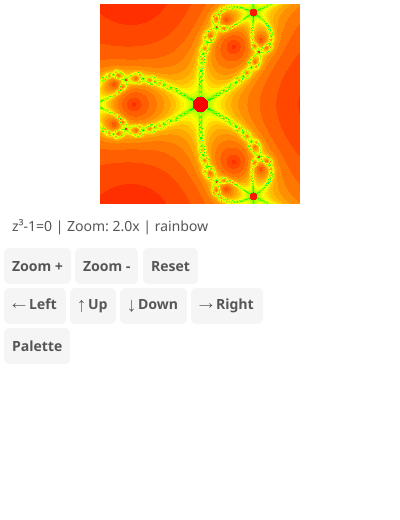

# Newton Fractal Explorer

Visualization of Newton's method convergence basins for the equation z³-1=0.

## Features

- Shows the three cubic roots of unity and their attraction basins
- Multiple color palettes (classic, fire, ice, rainbow, ocean, psychedelic, grayscale, copper)
- Click/tap to zoom and recenter
- Scroll wheel zoom centered on cursor
- Keyboard controls for navigation

## Controls

- **Click/Tap**: Zoom in at clicked point
- **Scroll**: Zoom in/out centered on cursor
- **+/-**: Zoom in/out
- **Arrow keys**: Pan
- **P/Space**: Cycle palette
- **R**: Reset view

## Algorithm

Newton's method iterates `z = z - f(z)/f'(z)` to find roots. For z³-1=0, this becomes `z = z - (z³-1)/(3z²)`. The fractal shows which root each starting point converges to, with colors indicating the number of iterations needed.
