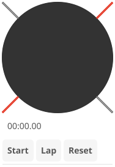

# Stopwatch

Stopwatch app with analog dial display and lap recording.

## Features

- Analog stopwatch dial with sweeping second hand
- Digital time display (minutes:seconds.centiseconds)
- Lap recording with lap times list
- Start/Stop/Reset/Lap controls
- Real-time updates at 60fps for smooth animation

## Controls

| Button | Action |
|--------|--------|
| Start | Begin timing |
| Stop | Pause timing |
| Reset | Clear stopwatch and laps |
| Lap | Record current time as a lap |

## Display

- **Analog dial**: 60-second sweep with tick marks
- **Digital display**: MM:SS.cc format
- **Lap list**: Shows all recorded lap times

## Services

The stopwatch app uses dependency injection for testability:

- `IClockService` - Provides high-resolution time for accurate timing
- `INotificationService` - For future notification features
- `IAppLifecycle` - Manages app close behavior
