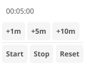

# Timer

Countdown timer app with quick-add buttons and visual feedback.

## Features

- Countdown timer with hours, minutes, seconds display
- Quick-add buttons: +1m, +5m, +10m, +30m, +1h
- Start/Pause/Reset controls
- Notification when timer completes
- Visual countdown display

## Controls

| Button | Action |
|--------|--------|
| +1m, +5m, etc. | Add time to the timer |
| Start | Begin countdown |
| Pause | Pause countdown |
| Reset | Clear timer |

## Services

The timer app uses dependency injection for testability:

- `IClockService` - Provides current time for elapsed calculation
- `INotificationService` - Sends notification when timer completes
- `IAppLifecycle` - Manages app close behavior
