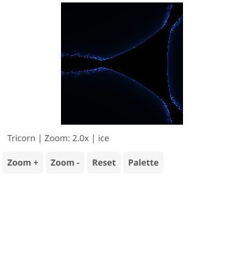

# Tricorn (Mandelbar) Fractal Explorer

The conjugate of the Mandelbrot set, creating distinctive horn-like shapes.

## Features

- Multiple color palettes (classic, fire, ice, rainbow, ocean, psychedelic, grayscale, copper)
- Click/tap to zoom and recenter
- Scroll wheel zoom centered on cursor
- Keyboard controls for navigation

## Controls

- **Click/Tap**: Zoom in at clicked point
- **Scroll**: Zoom in/out centered on cursor
- **+/-**: Zoom in/out
- **Arrow keys**: Pan
- **P/Space**: Cycle palette
- **R**: Reset view

## Algorithm

The Tricorn uses `z = conj(z)² + c` where conj() is the complex conjugate. This creates different symmetry than the Mandelbrot set, with three-fold rotational symmetry and distinctive "horns" at the top.
