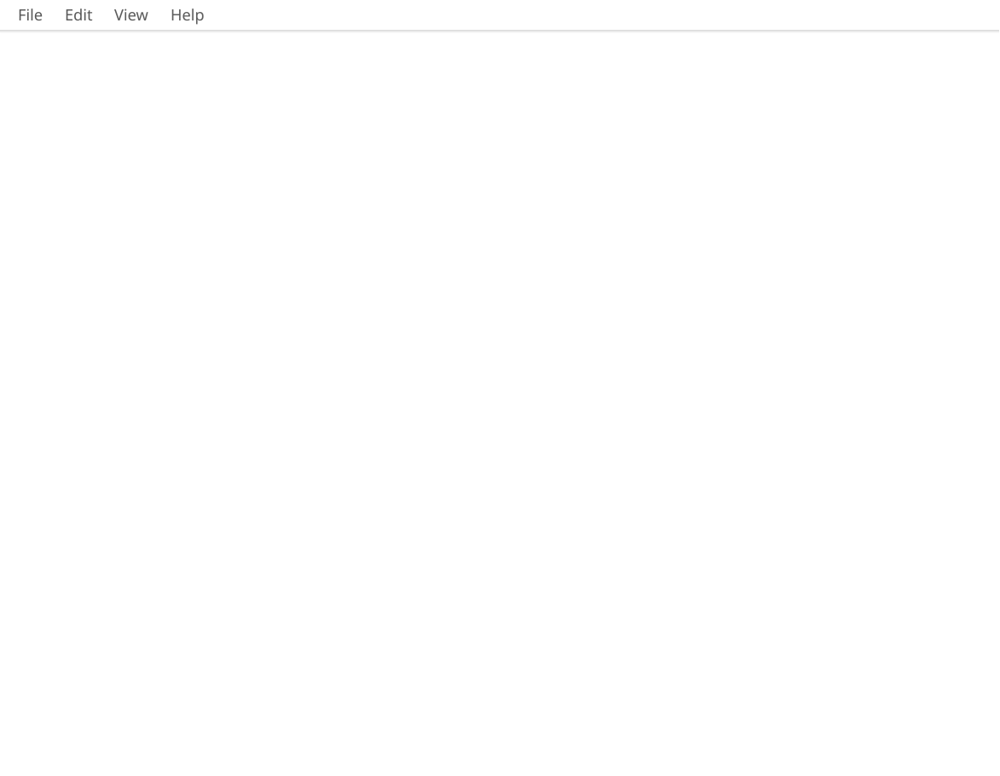
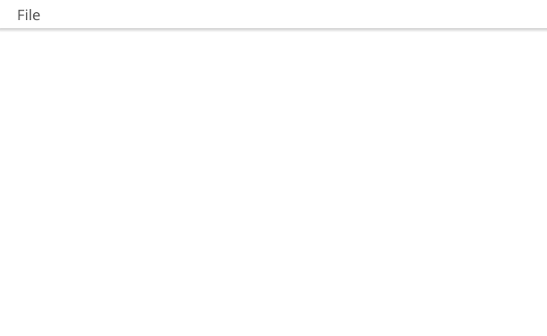
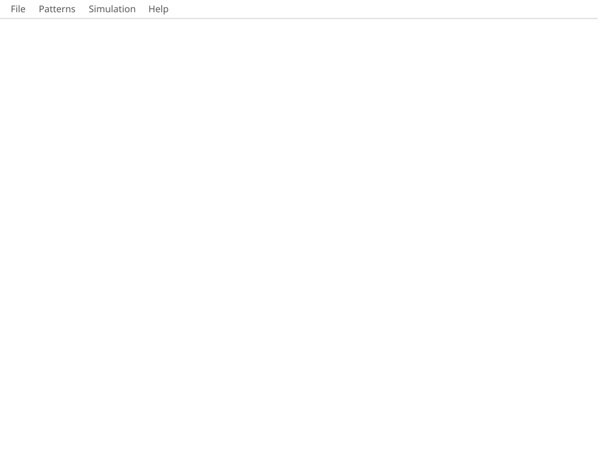

# Ported Applications

This directory contains applications that have been ported to Tsyne from other projects.

## Applications

| Application | Description | Original Source |
|-------------|-------------|-----------------|
| [**chess/**](chess/) | Classic chess game with computer opponent | [andydotxyz/chess](https://github.com/andydotxyz/chess) |
| [**solitaire/**](solitaire/) | Klondike solitaire card game | [fyne-io/solitaire](https://github.com/fyne-io/solitaire) |
| [**terminal/**](terminal/) | Terminal emulator demonstration | [fyne-io/terminal](https://github.com/fyne-io/terminal) |
| [**pixeledit/**](pixeledit/) | Pixel-based image editor | [fyne-io/pixeledit](https://github.com/fyne-io/pixeledit) |
| [**fyles/**](fyles/) | File manager application | [FyshOS/fyles](https://github.com/FyshOS/fyles) |
| [**slydes/**](slydes/) | Markdown presentation slides | [andydotxyz/slydes](https://github.com/andydotxyz/slydes) |
| [**image-viewer/**](image-viewer/) | Image viewer with editing | [Palexer/image-viewer](https://github.com/Palexer/image-viewer) |
| [**game-of-life/**](game-of-life/) | Conway's Game of Life | [fyne-io/life](https://github.com/fyne-io/life) |

## Running Tests

```bash
# From the ported-apps directory
npm test

# From the root directory
npm run test:ported-apps
```

## Screenshots

### Chess


### Solitaire


### Terminal


### Pixel Editor


### Slydes


### Image Viewer


### Game of Life


## Attribution

All applications are ported from their original sources listed above. See each application's directory for specific license information.
