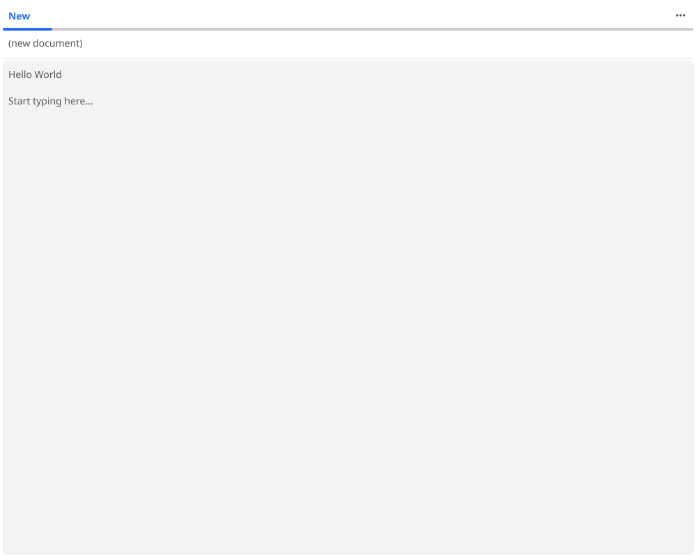

# Edlin Text Editor

A line-oriented text editor for Tsyne, ported from the original Go/Fyne application.



## Origin

Ported from [edlin](https://github.com/bshofner/edlin) by Bob Shofner.

**Original License:** MIT License - https://opensource.org/license/mit/

## Features

- **Multi-tab editing** - Open and edit multiple documents simultaneously
- **File operations** - New, Open, Save with native file dialogs
- **Edit operations** - Undo, Redo, Cut, Copy, Paste, Select All
- **Search/Replace** - Find text with case-insensitive option, replace one or all
- **Unicode support** - Full Unicode text including CJK characters
- **Help system** - Context-sensitive help for all features

## Running

### Standalone

```bash
npx tsx ported-apps/edlin/edlin.ts
```

### In PhoneTop

The app is automatically discovered by PhoneTop and appears in the Utilities folder.

## Architecture

```
edlin/
  edlin.ts           # Main app with UI and menus
  edlin-store.ts     # Document state management
  edlin-store.test.ts    # Jest unit tests for store
  edlin.test.ts      # TsyneTest integration tests
  README.md          # This file
```

### Store Pattern

The app follows the MVC pattern used by other Tsyne apps:

- **EdlinStore** - Manages multiple documents, clipboard, search operations
- **DocumentStore** - Individual document with content, undo/redo stack
- **EdlinApp** - UI component with menus, tabs, and editor widgets

## Testing

### Unit Tests (Jest)

```bash
npm test ported-apps/edlin/edlin-store.test.ts
```

Tests cover:
- Document creation and management
- Content manipulation
- Undo/Redo operations
- Search and replace functionality
- Change notification system

### Integration Tests (TsyneTest)

```bash
npm test ported-apps/edlin/edlin.test.ts
```

Visual debugging:
```bash
TSYNE_HEADED=1 npm test ported-apps/edlin/edlin.test.ts
```

### Screenshots

Generate screenshot:
```bash
TSYNE_HEADED=1 TAKE_SCREENSHOTS=1 npm test ported-apps/edlin/edlin.test.ts
```

## Menu Reference

### File Menu

| Item | Description |
|------|-------------|
| New | Create a new empty document |
| Open... | Open a file from disk |
| Save... | Save current document |
| Close Tab | Close the current tab |

### Edit Menu

| Item | Shortcut | Description |
|------|----------|-------------|
| Undo | Ctrl+Z | Undo last change |
| Redo | Ctrl+Y | Redo undone change |
| Cut | Ctrl+X | Cut selected text |
| Copy | Ctrl+C | Copy selected text |
| Paste | Ctrl+V | Paste from clipboard |
| Select All | Ctrl+A | Select all text |
| Find/Replace... | Ctrl+F | Open search dialog |

### Help Menu

Contextual help for File Menu, Edit Menu, Shortcuts, and Search operations.

## Differences from Go Version

The TypeScript port uses Tsyne's built-in `MultilineEntry` widget for text editing, rather than the custom `TextList` widget from the Go version. This provides:

- Standard text editing behavior
- Native keyboard shortcuts
- Consistent look across platforms

The line-marking feature (Begin ^M, End ^E) from the Go version is not implemented, as `MultilineEntry` handles text selection natively.

## License

MIT License - Same as the original edlin project.

Based on the original Go/Fyne application by Bob Shofner.
